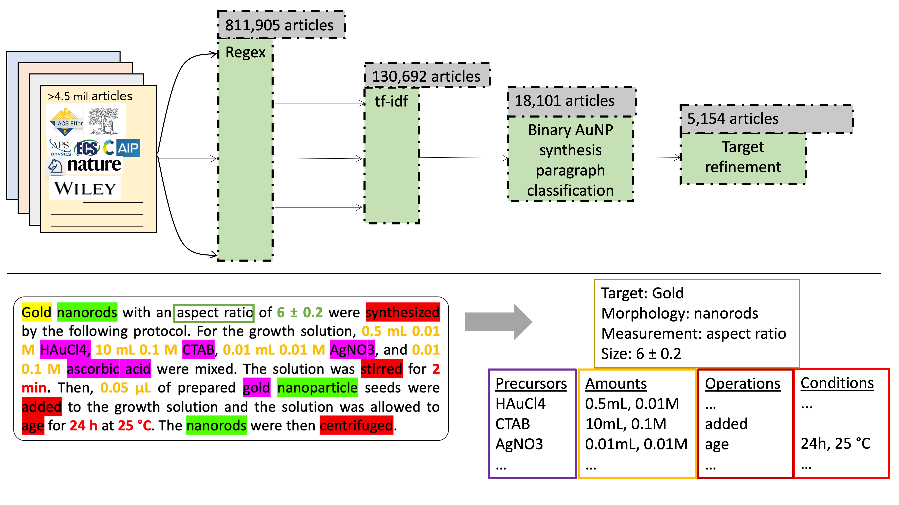

# Análise detalhada do repositório AuGOSintesIA

> Documento de referência: o que existe em cada pasta e arquivo, o que cada componente faz, como usá-lo
> e como ele se encaixa no projeto de IC FAPESP *"Plataforma de aprendizado ativo para o design de
> nanocompósitos GO–AuNP sob variabilidade multi-fonte de matéria-prima"*.
>
> Análise feita em 2026-09-29 sobre o commit `e18986f` (2 commits, ~2 870 arquivos, ~1,7 GB em disco).
> **Atualizado no mesmo dia:** 48 (depois 58, 75, hoje 89) repositórios externos em `external/` (§10), ambientes por
> subprojeto em `environments/` (§11) e correção dos problemas listados antes (§7).
> **Reorganizado:** a antiga pasta `Data/` foi dividida em `datasets/`, `projects/<módulo>/` e `external/`;
> `Articles/` virou `literature/` (§12). Os nomes antigos (`Data/…-main`) aparecem só no histórico do git.
> **Auditoria das fontes (2026-09-29):** as 16 fontes da proposta foram conferidas contra os originais, e as
> infraestruturas de dados foram integradas (dicionário PubChem, semente GO–AuNP, modelo de dados, pipeline
> OpenAlex→Crossref→Unpaywall, OPTIMADE, depósito Zenodo) — §13 e [`FONTES_DE_DADOS.md`](FONTES_DE_DADOS.md).

---

## Sumário

1. [Visão geral e mapa do repositório](#1-visão-geral-e-mapa-do-repositório)
2. [O projeto FAPESP (documento-guia)](#2-o-projeto-fapesp-documento-guia)
3. [Arquivos da raiz](#3-arquivos-da-raiz)
4. [`datasets/pubchem/` — fichas dos reagentes](#4-datasetspubchem--fichas-dos-reagentes)
5. [`datasets/` — dados avulsos](#5-datasets--dados-avulsos)
6. [`projects/` — subprojetos base](#6-projects--subprojetos-base)
   - 6.1 [GO-MACE-23 — potencial de ML e gerador de estruturas de GO](#61-go-mace-23--potencial-de-ml-e-gerador-de-estruturas-de-go)
   - 6.2 [AmberGO — modelos de GO compatíveis com AMBER/GAFF](#62-ambergo--modelos-de-go-compatíveis-com-ambergaff)
   - 6.3 [text-mined-aunp-synthesis — receitas de AuNP mineradas da literatura](#63-text-mined-aunp-synthesis--receitas-de-aunp-mineradas-da-literatura)
   - 6.4 [Synthesis-Properties-Database-for-Nanomaterials — extração com LLM (Qwen3-14B)](#64-synthesis-properties-database-for-nanomaterials--extração-com-llm-qwen3-14b)
   - 6.5 [SDL — laço de BO simples com ruído](#65-sdl--laço-de-bo-simples-com-ruído)
   - 6.6 [Bgolearn — BO para materiais (pacote pronto)](#66-bgolearn--bo-para-materiais-pacote-pronto)
   - 6.7 [RAMBOAU — BO multiobjetivo avesso a risco (ruído aleatório)](#67-ramboau--bo-multiobjetivo-avesso-a-risco-ruído-aleatório)
   - 6.8 [chem-MFBO — BO multi-fidelidade (MISO)](#68-chem-mfbo--bo-multi-fidelidade-miso)
   - 6.9 [BOCoDe — suíte de benchmarks + 31 algoritmos de referência](#69-bocode--suíte-de-benchmarks--31-algoritmos-de-referência)
   - 6.10 [MatDesINNe — design inverso com redes invertíveis](#610-matdesinne--design-inverso-com-redes-invertíveis)
   - 6.11 [M2Hub — GNNs e benchmarks de materiais](#611-m2hub--gnns-e-benchmarks-de-materiais)
   - 6.12 [`self-driving-lab/qubot/` — robô modular de laboratório (hardware, dados, scripts)](#612-self-driving-labqubot--robô-modular-de-laboratório-hardware-dados-scripts)
   - 6.13 [`datasets/xrd-ceo2-calibration/` — imagens de detector GE (.ge3)](#613-datasetsxrd-ceo2-calibration--imagens-de-detector-ge-ge3)
7. [Problemas encontrados e como foram corrigidos](#7-problemas-encontrados-e-como-foram-corrigidos)
8. [Como combinar tudo no pipeline GO–AuNP](#8-como-combinar-tudo-no-pipeline-goaunp)
9. [Receitas rápidas (cola)](#9-receitas-rápidas-cola)
10. [Repositórios externos (external)](#10-repositórios-externos-external)
11. [Ambientes isolados (environments/)](#11-ambientes-isolados-environments)
12. [`literature/` — corpus dos artigos citados](#12-literature--corpus-dos-artigos-citados)
13. [Fontes de dados, curadoria e depósito](#13-fontes-de-dados-curadoria-e-depósito)
14. [`code/` — GO Navigator e AuNP Designer; verificação do repositório](#14-code--go-navigator-e-aunp-designer-verificação-do-repositório)
15. [Proposta × ferramentas: revisão de atualidade (2026-09-29)](#15-proposta--ferramentas-revisão-de-atualidade-2026-09-29)
16. [Ecossistema JARVIS e design inverso atomístico GO–Au](#16-ecossistema-jarvis-e-design-inverso-atomístico-goau)
17. [Fechamento do checklist do núcleo da proposta (2026-10-02)](#17-fechamento-do-checklist-do-núcleo-da-proposta-2026-10-02)
18. [Segunda auditoria: desenho estatístico e itens restantes (2026-10-02)](#18-segunda-auditoria-desenho-estatístico-e-itens-restantes-2026-10-02)
19. [Terceira auditoria: da bancada ao modelo (2026-10-03)](#19-terceira-auditoria-da-bancada-ao-modelo-2026-10-03)
20. [A proposta com os dados experimentais disponíveis: o site (2026-10-04)](#20-a-proposta-com-os-dados-experimentais-disponíveis-o-site-2026-10-04)

---

## 1. Visão geral e mapa do repositório

O repositório **não é um software único**: é uma coleção curada de (a) o projeto de pesquisa, (b) o corpus
de artigos citados, (c) datasets, (d) **13 subprojetos de terceiros** (código + dados, já corrigidos para
rodar em qualquer SO), (e) **89 repositórios de referência** clonados (§10; inclusive o ecossistema JARVIS, §16) e
(f) a camada de fontes de dados (§13). Cada subprojeto tem
dependências próprias e **deve ser usado em ambiente virtual separado** (`tools/setup_env.sh`, §11).

```
AuGOSintesIA/
├── README.md, CLAUDE.md, LICENSE, .gitattributes (Git LFS), .gitignore, .idea/ (PyCharm)
├── docs/
│   ├── ANALISE_REPOSITORIO.md          # este documento
│   ├── FONTES_DE_DADOS.md              # auditoria das fontes + integração (§13)
│   └── projeto/Projeto_FAPESP_Iniciação_Rafael_Lopes.docx
├── literature/                         # 65 artigos em texto: .md combinado, chunks.jsonl (RAG), relatório (§12)
├── datasets/                           # dados avulsos (catálogo em datasets/README.md)
│   ├── aunc-fluorescence/              # 207 nanoclusters de Au (λexc, λem, ligante, T, pH, t)
│   ├── nanocrystal-synthesis-db/       # base síntese→propriedade de Gu et al. (LFS) + estatística de nomes
│   ├── aunp-text-mined/                # 5 154 artigos de AuNP minerados (LFS; = .zip do text-mined)
│   ├── cofs-methane/                   # 69 839 COFs (armazenamento de CH4)
│   ├── pressure-vessel/                # 52 272 laminados compósitos
│   ├── pubchem/                        # 53 fichas de reagentes (Au, CTAB, citrato, NaBH4, GO…)
│   ├── reagents/                       # dicionário de reagentes normalizado (PubChem) (§13)
│   ├── literature-seed/                # semente GO–AuNP: Cruse + NSP + AuNCs normalizados (§13)
│   ├── data-model/                     # modelo de dados do laboratório (NanoCommons/eNanoMapper) (§13)
│   ├── lab/                            # dados experimentais (a preencher)
│   └── xrd-ceo2-calibration/           # 4 imagens de detector GE (.ge3): CeO2 e dark
├── projects/                           # 13 subprojetos base, por módulo (índice em projects/README.md)
│   ├── atomistic/            GO-MACE-23, AmberGO
│   ├── literature-llm/       text-mined-aunp-synthesis, Synthesis-Properties-Database-for-Nanomaterials
│   ├── bayesian-optimization/ SDL, Bgolearn, RAMBOAU, BOCoDe
│   ├── multi-fidelity/       chem-MFBO
│   ├── inverse-design/       MatDesINNe
│   ├── materials-ml/         M2Hub
│   └── self-driving-lab/qubot/  hardware/ (CAD, BOM), data/, scripts/, README.pdf
├── code/                               # código do projeto: espectral, caracterização, Navigator, Designer, benchmark, causal, atomístico/JARVIS (§14–§16)
├── external/                           # 89 repositórios de referência (+ data-access/: clientes de API; jarvis/: JARVIS) (§10, §16)
├── environments/                       # um ambiente por subprojeto (§11)
├── deposit/GO-AuNP-Autonomous-Design/  # estrutura do depósito Zenodo/MDF (§13)
└── tools/                              # setup_env.sh, fetch_external.sh, external_repos.lock.tsv, data_sources/ (§13)
```

### Mapa rápido: componente → papel no projeto

| Componente | Tipo | Papel no projeto GO–AuNP |
|---|---|---|
| Projeto FAPESP (.docx) | Documento | Define objetivos, hipóteses, métricas e cronograma |
| datasets/pubchem/ | Dados de referência | Identidade/propriedades dos reagentes (HAuCl₄, CTAB, citrato, NaBH₄, ác. ascórbico, PVP, GO) |
| GO-MACE-23 | Simulação atomística | Gerar/relaxar estruturas de GO com O/C e OH/epóxi controlados → descritores do **GO Navigator** |
| AmberGO | Simulação MD clássica | Modelos de GO de 5 %–68 % de oxidação para MD (adsorção de Au, ligantes) |
| text-mined AuNP | Dataset de literatura | Priors/espaço de busca para receitas de AuNP (**curadoria 4.1**) |
| Synthesis-Properties DB (Qwen3) | LLM | Extração automática receita→propriedade (**curadoria assistida por LLM**) |
| DATASET_AuNCs | Dataset | Mini-base de nanoclusters de Au para testar modelos pequenos (n≈200) |
| SDL | Código didático | Aprender o laço BO (surrogate + UCB) e efeito do ruído/dimensão |
| Bgolearn | Biblioteca | BO pronto sobre "amostras virtuais" (EI, UCB, PoI, KG, PES…) — ideal para as primeiras campanhas |
| RAMBOAU | Biblioteca/pesquisa | **qNEHVI** + versões avessas a risco (MVaR) para ruído heteroscedástico → **AuNP Designer** |
| chem-MFBO | Biblioteca/pesquisa | Custos por fidelidade, MF-KG → base para **MISO** (UV-Vis barato × TEM/XPS caro) |
| BOCoDe | Benchmark | Protocolo de benchmark justo (seeds, orçamento) + dataset **AgNP** real (perda espectral) |
| MatDesINNe | Design inverso | Modelo generativo condicional (cINN/cVAE) → propriedade-alvo → receita (**módulo 4.6**) |
| M2Hub | GNN/benchmark | Predição de propriedades a partir de estrutura; métricas para modelos generativos |
| Qubot | Hardware + dados | Referência de SDL de baixo custo, protocolos de repetibilidade, análise de EIS |
| datasets/xrd-ceo2-calibration/*.ge3 | Dados brutos | Exemplo de dados de difração 2D (calibração CeO₂) para o fluxo SAXS/WAXS |

---

## 2. O projeto FAPESP (documento-guia)

**Arquivo:** `docs/projeto/Projeto_FAPESP_Iniciação_Rafael_Lopes.docx` (IC, 12 meses, SisPlexos/DFM/IQ-UNESP Araraquara;
orientador Prof. Dr. Henrique A. M. Faria; candidato Rafael Alexandre de Pinho Lopes).

**Pergunta central:** em síntese de GO–AuNP guiada por aprendizado ativo, *quando* medir a matéria-prima
(lote de GO, impurezas de reagentes) melhora a decisão, e quando o custo não compensa (EVSI/EVPI)?

**Módulos previstos e onde o repositório já ajuda:**

| Módulo do projeto | Descrição no projeto | Recurso no repositório |
|---|---|---|
| Curadoria (4.1) | Dados rastreáveis, FAIR, LLM p/ extrair receitas | `literature/` (65 artigos em texto), `text-mined-aunp…`, `Synthesis-Properties…`, `datasets/nanocrystal-synthesis-db`, `datasets/aunc-fluorescence` |
| GO Navigator (4.2) | Descritores do lote (C/O, XPS, Raman, FTIR, XRD), Batch Fingerprint | `GO-MACE-23` (estruturas com O/C, OH:epóxi controlados), `AmberGO`, `datasets/pubchem/…RefChem 782691 (Graphene oxide)` |
| Módulo de impurezas (4.3) | CTAB (iodeto), OCP | `datasets/pubchem/` (CTAB CID 5974, cetrimônio CID 2681) — descritores ainda a construir |
| Função objetivo (4.4) | Perda espectral J (UV-Vis) + diâmetro | `BOCoDe` → `AgNP` usa exatamente uma *loss* espectral (Mekki-Berrada 2021) |
| AuNP Designer (4.5) | GP Matérn 5/2 + ARD, qNEHVI, 4 braços de contexto, novelty-aware | `RAMBOAU` (qNEHVI/qLogNEHVI BoTorch), `BOCoDe/algorithms`, `Bgolearn` |
| Modelos diferenciáveis/generativos (4.6) | Neural Processes, VAE/difusão para design inverso | `MatDesINNe` (cINN, cVAE, MDN), `Synthesis-Properties…/inverse_design` |
| Transfer learning (4.7) | Multi-task/hierarchical GP, LBO | `chem-MFBO` (GP multi-tarefa vs multi-fidelidade: `regression/mt_vs_mf_regression.py`) |
| MISO (4.8) | cost-sensitive KG, MGP/ICM/PCM | `chem-MFBO` (`qMultiFidelityKnowledgeGradient`, `InverseCostWeightedUtility`) |
| Benchmark (4.15) | Múltiplas seeds, orçamento igual, hypervolume | `BOCoDe` (protocolo 25 seeds, traços `.npz`), `SDL`, `RAMBOAU/visualization` |
| SDL/cloud lab (4.16) | Integração opcional com robô | `projects/self-driving-lab/qubot/` (`hardware/` + `scripts/tutorial`, biblioteca `control-lab-ly`) |
| SAXS/WAXS (4.4/4.12) | Caracterização estrutural in situ | `datasets/xrd-ceo2-calibration/*.ge3` (frames de calibração CeO₂ + dark) |

---

## 3. Arquivos da raiz

| Arquivo | Conteúdo | Observações |
|---|---|---|
| `README.md` | Resumo do repositório + link para este documento | |
| `CLAUDE.md` | Guia rápido para agentes (mapa + cuidados) | |
| `.gitignore` | ignora `.venvs/` e `__pycache__/` | |
| `LICENSE` | MIT © 2026 Rafael Alexandre | Os subprojetos em `projects/` e `external/` mantêm **suas próprias licenças** (MIT, GPL-3 no AmberGO etc.) |
| `.gitattributes` | 13 caminhos rastreados por **Git LFS** | Requer `git lfs install` antes do clone (ou `git lfs pull` depois) — §7.1 |
| `.idea/` | Projeto PyCharm, SDK "Python 3.13" | Sem efeito fora do PyCharm |
| `docs/projeto/Projeto_FAPESP_…docx` | Projeto de pesquisa completo (§2) | Ler com Word/LibreOffice ou `pandoc` |
| `literature/` | Corpus dos artigos citados (§12) | |
| `datasets/`, `projects/`, `external/` | Ver §5, §6 e §10 | cada pasta tem um `README.md` |

---

## 4. `datasets/pubchem/` — fichas dos reagentes

53 arquivos baixados do PubChem (PUG-View). Três formatos:

- `COMPOUND_CID_<cid>.json` — ficha completa (nomes, identificadores, propriedades, segurança, espectros…).
- `Structure2D_COMPOUND_CID_<cid>.json` / `Conformer3D_COMPOUND_CID_<cid>.json` — estrutura em formato
  `PC_Compounds` (átomos, ligações, coordenadas 2D/3D).
- `REFCHEM_RefChemID_<id>.json` — registros "Reference Chemical".
- `COMPOUND_CID_173060718.xml` — mesma ficha em XML (Gold;hydron;tetrachloride).

| CID / ID | Composto | Papel na síntese GO–AuNP |
|---|---|---|
| 122706823, 28133, 57481028, 10925836, 19994376, 23619392, 173060718 | Ácido tetracloroáurico / HAuCl₄ (várias representações) | **Precursor de ouro** |
| RefChem 922420 | Gold chloride | Precursor de ouro |
| 4311764 | NaBH₄ | Redutor forte (sementes) |
| 54670067 | Ácido L-ascórbico | Redutor fraco (crescimento) |
| 6224 | Citrato trissódico | Redutor/estabilizante (Turkevich) |
| 311 (só 3D) | Ácido cítrico | Idem |
| 5974 | CTAB | Surfactante direcionador de forma (impurezas: iodeto!) |
| 2681 (só 3D) | Cátion cetrimônio (C₁₉H₄₂N⁺) | Parte catiônica do CTAB |
| 6917 | N-vinil-2-pirrolidona | Monômero do PVP (estabilizante) |
| 20011 / 20012 (3D) | Quaternium-15 / seu cátion | Surfactante/aditivo quaternário |
| RefChem 782691 | **Graphene oxide** | Suporte |
| RefChem 4004 | Peisleyite | (mineral; provavelmente baixado por engano) |
| 14798, 313, 702, 962 | NaOH, HCl, etanol, água | Ajuste de pH, solventes |

**Como usar:**

```python
import json
rec = json.load(open("datasets/pubchem/COMPOUND_CID_5974.json"))["Record"]
def find(sec, heading):                       # busca recursiva por TOCHeading
    for s in sec.get("Section", []):
        if s.get("TOCHeading") == heading: return s
        r = find(s, heading)
        if r: return r
mw = find(rec, "Molecular Weight")["Information"][0]["Value"]
```

Aplicação: montar uma tabela de reagentes (MW, fórmula, InChIKey, GHS) para cálculo de concentrações/
E-factor (§4.14 do projeto) e para normalizar nomes em dados minerados (sinônimos).

---

## 5. `datasets/` — dados avulsos

### 5.1 `aunc-fluorescence/` (`DATASET_AuNCs.csv` / `.xlsx`) — nanoclusters de ouro
- 207 linhas × 11 colunas (CSV separado por `;`, codificação **latin-1**; a planilha é a mesma, aba `Hoja1`).
- Colunas: `Entry`, `Size (nm)` (0,6–3,9; mediana 2), `Measuring Solvent` (17 valores, 152× água),
  `λexc (nm)` (262–800), `λem (nm)` (371–1100), `Ligand` (9; GSH em 182), `Au atoms` (só 18 preenchidos),
  `Synthesis T (ºC)` (texto: "70", "RT"…), `Synthesis pH` (só 58), `Synthesis time (h)`, `DOI` (167 únicos).
- Provável base do trabalho de Sánchez-Dueñez et al. (2025, ACS Omega) citado no projeto.
- **Uso:** regressão de λem a partir de condições (GP pequeno / RF). Cuidado: `Synthesis T` precisa ser
  convertida ("RT"→25), vários DOIs repetidos → usar *group split* por DOI.

```python
import pandas as pd
df = pd.read_csv("datasets/aunc-fluorescence/DATASET_AuNCs.csv", sep=";", encoding="latin-1")
```

### 5.2 `nanocrystal-synthesis-db/statistics_of_product_names.xlsx` (antes `Statistics%20of%20Product%20Names.xlsx`)
- 95 262 linhas × 2 (`Names`, `Counts`): frequência dos nomes de produtos na base de Gu et al. (2026)
  (AgNPs 1 247, AuNPs 1 095, "Gold Nanoparticles" 870, "Au NPs" 427…).
- **Uso:** dicionário de sinônimos para normalizar "AuNPs/Au NPs/Gold Nanoparticles" ao filtrar a base.

### 5.3 `nanocrystal-synthesis-db/` — `README.md`, `gitattributes`, `dataset*.json`
- São o *dataset card* do HuggingFace `Kai-gu/Synthesis-Properties-Database-for-Nanomaterials`
  (licença MIT, 10k–100k amostras). Descreve `dataset.json` (bruto) e `dataset_low_conf_skip-clean.json`
  (limpo, sem respostas de baixa confiança) com campos `sample_id, title, paragraph, step_number,
  step_content, product_id, product_name, route_sequence, property_name, value`.
- São arquivos **Git LFS**: rode `git lfs install && git lfs pull` (os objetos estão no GitHub do
  repositório). `dataset.json` = 100 731 registros (531 MB); `dataset_low_conf_skip-clean.json` = 47 023.
  O formato real de cada registro é `{sample_id, title, paragraph, extracted_content, confidence}`, com os
  passos/rotas/propriedades dentro de `extracted_content` (o texto do card lista os campos já "achatados").
- Fonte alternativa: `huggingface-cli download Kai-gu/Synthesis-Properties-Database-for-Nanomaterials --repo-type dataset`.

### 5.4 README.pdf do Qubot (movido para `projects/self-driving-lab/qubot/`)
- README da publicação **Qubot** (ver §6.12): explica `data/`, `scripts/` e o hardware (agora em `projects/self-driving-lab/qubot/`, com `qubot/` → `hardware/`).

### 5.5 `cofs-methane/dataset_v1.csv` — COFs para armazenamento de metano
- 69 839 COFs × 43 colunas: topologia (`net`, `linkerA/B`, `bond_type`, `dimensions` 2D/3D), geometria
  (`voidFraction`, `surface_area`, `density`, `largest_incl_sphere`…, parâmetros de célula), composição
  (`num_carbon`…), adsorção GCMC (`highUptake_*` ≈ 65 bar, `lowUptake_*` ≈ 5,8 bar, calores de dessorção)
  e o alvo `del_capacity` (capacidade de entrega de CH₄, v/v; 4,5–217).
- Corresponde ao conjunto de COFs de Mercado et al. (armazenamento de metano). **Não é referenciado por
  nenhum código** do repositório. (Correção: o "problema COF" do `chem-MFBO` é *outro* conjunto — 608 COFs
  de separação Xe/Kr, SimonEnsemble — agora restaurado em `chem-MFBO/data/clean/cofs.csv`, §6.8.)
- **Uso:** benchmark grande de BO/triagem virtual (`del_capacity` como alvo); para multi-fidelidade, uma
  propriedade barata correlacionada (ex.: `surface_area`, `voidFraction`) pode fazer o papel de LF.

### 5.6 `pressure-vessel/pressure_vessel_DS.csv` — laminados compósitos
- 52 272 linhas × 9: `SAngle` (0–175°), `Nrplies` (8–40), `Stepply`, `SymLam` (0/1), `Thickpl` (1–2),
  `S11`, `S22`, `Thick`, `min_val`. Grade completa de projeto de laminado de vaso de pressão (valor mínimo
  de um critério/fator de segurança). Também **órfão** (nenhum código usa).
- **Uso:** problema discreto grande para testar BO em tabela (tipo "virtual samples" do Bgolearn).

### 5.7 Arquivos LFS: `aunp-text-mined/aunp-synthesis_dataset_2021-9-14.json` e `nanocrystal-synthesis-db/dataset*.json`
- Arquivos **Git LFS** (antes apareciam como ponteiros de 133 bytes). Com `git lfs pull` vêm completos.
  O primeiro é idêntico (byte a byte) ao conteúdo de
  `text-mined-aunp-synthesis/aunp-synthesis_dataset_2021-9-14.json.zip` (51 MB).

---

## 6. `projects/` — subprojetos base

### 6.1 GO-MACE-23 — potencial de ML e gerador de estruturas de GO

**Origem:** El-Machachi, …, Deringer, *Angew. Chem. Int. Ed.* 2024, e202410088 (citado no projeto);
Zenodo 10.5281/zenodo.14066557.

**O que é:** (1) um **potencial interatômico MACE** treinado em DFT (CASTEP, PBE, 550 eV) para sistemas
C/H/O; (2) código que **gera estruturas de óxido de grafeno** a partir de grafeno com parâmetros
controlados; (3) as estruturas finais de MD de 2 ns.

**Estrutura:**

| Caminho | Conteúdo |
|---|---|
| `code/generate_GO.py` | Classe `build().main(...)`: orquestra desordem → bordas → epóxi → hidroxila → `rattle(0.02)` → grava `.xyz` |
| `code/bulk_oxidation.py` | `add_epoxy_group` (O no meio de ligação C–C, 2 C oxidados), `add_hydroxyl_group` (O sobre 1 C), `pick_random_carbon`; buckling 0,10–0,16 Å (epóxi) e 0,10–0,36 Å (OH) |
| `code/edge_oxidation.py` | `add_edge_functionality` troca H de borda por COOH, CHO ou OH; `get_edge_carbons` |
| `code/amorphous.py` | `select_disordered(p6, db)` escolhe estrutura amorfa pelo parâmetro p6; `cleave_amorphous` cria borda com vácuo; `saturate_amorphous` satura com H (C–H 1,09 Å) |
| `code/utilities.py` | `is_structure_valid` (colisão por raios de vdW com imagem mínima) |
| `code/run.py` | Exemplo: grafeno 2D periódico, `O_content=0.5`, `OH_fraction=0.5` |
| `code/run_edges.py` | Nanofita 7×5 armchair, `O_content=0.3`, varre `OH_fraction` 0–1 e `p4` 0,1–0,5 |
| `code/run_amorphpus.py` | Grafeno amorfo, `O_content` 0,10–0,30, `p6` 0,3–0,8 (espaçamento quadrático) |
| `models/fitting/README.md` | Histórico do **aprendizado ativo** iter-0 → iter-12 e hiperparâmetros MACE/DFT |
| `models/fitting/potential/iter-N/` | Para cada iteração: `train.sh`, `MACE_model.model`, `MACE_model_swa.model`, `checkpoints/*.pt`, `structures/iter-N-{train,test}.xyz`, `logs/*.log`, `results/*.txt` |
| `models/fitting/potential/iter-12-final-model/go-mace-23.pt` | **Modelo de produção** (≈6 MB) |
| `structures/{900K,1200K,1500K}/` | GO após 2 ns de *annealing* a 900/1 200/1 500 K (`GO_2000ps.xyz`) e relaxado (`optimized.xyz`), ~12–15 mil átomos; `1500K/GO_1500ps.xyz` é o da Fig. 3 |

**Parâmetros estruturais** (nomenclatura do paper p₁–p₄; mapeamento inferido do código):
- `O_content` (p₁): nº de O = `round(O_content × N_C)` → razão O/C.
- `OH_ratio` (p₂): fração dos O que são hidroxila; o resto vira epóxi.
- `disorder` + `p6` (p₃): partir de grafeno amorfo com grau de desordem p6.
- `edges` + `p4` (p₄): fração dos H de borda substituídos por COOH/CHO/OH.

**Qualidade do modelo final (iter-12-clean, log):** RMSE energia 1,8 meV/átomo; RMSE força 98 meV/Å
(treino) e 107 meV/Å (validação) — erro relativo de força ≈ 5–6 %. Treino: `ScaleShiftMACE`,
`hidden_irreps=128x0e+128x1o`, `r_max=3.7 Å`, Huber loss, SWA, EMA, 2 100 épocas, E0s de H/C/O fixos.

**Como usar:**

```bash
pip install ase numpy            # gerador (testado: funciona sem GPU)
cd projects/atomistic/GO-MACE-23/code
python run.py                    # gera GO-0.50-0.50.xyz (célula pequena: 8 C + 4 O + 2 H)
```

Para uma folha maior, edite em `run.py` o `graphene_nanoribbon(2, 1, …)` (p.ex. `(10, 10, …)`) e as
listas `O_content_range`/`OH_fraction_range`. Para simular com o potencial:

```python
# pip install mace-torch  (use uma versão compatível com modelos de 2023; teste antes)
from ase.io import read
from mace.calculators import MACECalculator
atoms = read("GO-0.30-0.50.xyz")
atoms.calc = MACECalculator(model_paths="…/iter-12-final-model/go-mace-23.pt", device="cpu")
print(atoms.get_potential_energy())
# depois: ase.optimize.BFGS para relaxar, ase.md.Langevin para MD a 900–1500 K
```

**Novidades nesta cópia:** `code/make_amorphous_db.py` gera o banco de grafeno amorfo exigido por
`run_amorphpus.py` (substituto do `aG_p6.xyz` não publicado — §7.2); os `train.sh` usam `mace_run_train`.
`bulk_oxidation.py` pergunta (via `input`) se deve continuar quando a estrutura passa de 300 átomos;
`GO_ALLOW_LARGE=1` responde "sim" automaticamente (execuções em lote, como `run_amorphpus.py`).
Testado: `go-mace-23.pt` carrega no `mace-torch` 0.3.16 e reproduz as energias DFT do conjunto de teste com
erro médio de 1,7 meV/átomo.

**Aplicação no projeto (GO Navigator):** gerar uma biblioteca de GO com O/C e OH:epóxi variando como os
lotes reais L1–L6; relaxar/anelar com o MACE e extrair descritores simulados (densidade de grupos, fração
sp³, distribuição de distâncias, sítios para nucleação de Au) para comparar com XPS C 1s/Raman/FTIR medidos.
Os `.xyz` de treino (energias/forças DFT) também servem para ajuste fino do MACE com Au (fora do escopo
original: o modelo **não contém Au**).

---

### 6.2 AmberGO — modelos de GO compatíveis com AMBER/GAFF

**Licença:** GPL-3.0. Zenodo 10.5281/zenodo.17863270. Depende do **HierGO**
(github.com/IFM-molecular-simulation-group/HierGO; Garcia et al., *2D Mater.* 2023).

**Arquivos:**
- `Building_AMBER_Compatible_Graphene_Oxide_Tutorial.pdf` — protocolo passo a passo (19 MB).
- `Tutorial.zip` — scripts e exemplos: `decorate-tile_modified.py` (versão do `decorate-tile.py` do HierGO
  que não quebra em oxidação ≥ 40 %), Tcl para VMD (`1_GO_atom_info_assignment.tcl` → resíduos GRA/OH/EPX
  e tipos GAFF `ca, c3, oh, ho, os`; `2_atom_type_counter.tcl`; `3_CO_ratio.tcl` (calcula C/O);
  `4_snapshot.tcl`), `5_mol2_substruct_numpy.py`, `gaff.dat`, `gaff2.dat`, `GO_gaff_Hoshin.frcmod`,
  `GO_gaff2_Merve.frcmod` (parâmetros de ligação/ângulo/diedro), PDBs de exemplo (GO20, GO60, 30×20 Å).
- `Data/All_final_models.zip` — **15 modelos finais `.mol2`** (grafeno puro e GO 5 %, 10 %, …, 68 % de
  oxidação; folhas 20×20 nm, não periódicas).
- `Data/Example_models_with_intermediate_files.zip` — GRA, GO45 %, GO68 % com todos os arquivos
  intermediários (1_…pdb → 7_…final.mol2).

**Fluxo (resumo do tutorial):**
1. `create-tile.py --xfactor 13 --yfactor 8 --percentvac 0 --non_periodic` (Lx ≈ 2,5·xfactor Å).
2. `decorate-tile(.._modified).py --percento 20 --fresh 2:1` (O% e razão epóxi:hidroxila).
3. Limpar átomos soltos/H de borda no **Discovery Studio Visualizer**, exportar PDB com `CONECT`.
4. VMD → salvar `.mol2`; rodar `1_GO_atom_info_assignment.tcl` (tipos GAFF, resíduos).
5. Verificar contagens/razão C/O (Tcl 2 e 3), corrigir artefatos, `5_mol2_substruct_numpy.py`.
6. Usar `.mol2` + `.frcmod` no `tleap` (AMBER).

**Aplicação:** MD clássica de GO com diferentes graus de oxidação interagindo com íons AuCl₄⁻, citrato,
CTAB — hipótese de sítios de nucleação (Gonçalves et al. 2009). Complementa o GO-MACE (que é reativo/DFT
mas sem Au e caro).

---

### 6.3 text-mined-aunp-synthesis — receitas de AuNP mineradas da literatura

**Origem:** Cruse et al., *Sci. Data* 9, 234 (2022) (citado no projeto). Grupo Ceder.



**Pipeline:** > 4,5 mi artigos → regex (811 905) → tf-idf (130 692) → classificação de parágrafos de síntese
de AuNP (18 101) → refinamento de alvo → **5 154 artigos**, 7 608 parágrafos de receita e 12 519 de
caracterização.

**Arquivos:**
| Arquivo | Conteúdo |
|---|---|
| `aunp-synthesis_dataset_2021-9-14.json.zip` | **Dataset** (lista de 5 154 artigos) |
| `dataset_typing.py` | Esquema tipado (`Paper → Paragraph → Sentence → ProcedureStep`, `MatQuant`, `MorphInfo`, `SynthAction`) |
| `aunp_dataset_analysis.ipynb` (+ cópia idêntica em `.ipynb_checkpoints/`) | Análises: precursores por categoria, seed-mediated vs seedless, evolução de morfologias 1998–2021 |
| `rsc/aunp_precursor_syns_regex.json` | Regex de sinônimos de precursores (HAuCl₄, NaAuCl₄, AuCl₃, Ag⁺, CTAB…) |
| `rsc/aunp_morph_syns_regex.json` | Regex de morfologias (rod, sphere, cube, octahedra, star, wire, triangle, plate, …) |
| `rsc/aunp_garbage_precs.json` | Precursores-lixo a descartar ("L-1", "AuNP", …) |
| `data/au_tfidf_dois_06-01-2021.zip` | 131 103 DOIs após tf-idf |
| `data/nano_regex_dois_01-08-2021.zip` | 812 316 DOIs após regex |
| `morphs.png`, `morphs_sub.png`, `precursors.png`, `docs/ExtractionPipeline.png` | Figuras do paper |
| `.gitmodules` | Submódulos **não incluídos**: MatEntityRecognition, MaterialParser, MaterialAmountExtractor (CederGroupHub) |

**Estrutura de um registro:**
```
{doi, publication_year, times_referenced,
 paragraphs: [{_id, text, contains_recipe, contains_characterization, seed_mediated,
               materials_and_quantities, synth_actions[{string,type,conditions{temperature,time}}],
               morphological_information{descriptors,measurements,morphologies,sizes,units},
               morphology_ner_tokens, sentences[{precursors[{material,amount}], targets,
               procedure_graph[{op_type,op_token,subject,temp_values,time_values,…}]}]}]}
```

**Como usar:**
```python
import json, zipfile
with zipfile.ZipFile("projects/literature-llm/text-mined-aunp-synthesis/aunp-synthesis_dataset_2021-9-14.json.zip") as z:
    data = json.loads(z.read("aunp-synthesis_dataset_2021-9-14.json"))
recipes = [(p["doi"], q) for p in data for q in p["paragraphs"] if q["contains_recipe"]]
```
O notebook roda a partir da própria pasta (lê o `.zip` direto); precisa de `regex`, `matplotlib`, `numpy`.

**Aplicação:** filtrar receitas com GO/grafeno (`"graphene oxide" in q["text"]`) e rotas citrato/NaBH₄/
ascórbico para definir **limites do espaço de busca** (concentrações, T, tempo) e priors; contar quais
reagentes são mais comuns para priorizar a caracterização de lotes (projeto §4.1: usar como
priorização, não como substituto de medições).

---

### 6.4 Synthesis-Properties-Database-for-Nanomaterials — extração com LLM (Qwen3-14B)

**Origem:** Gu et al., *ACS Nano* 20, 17413 (2026), DOI 10.1021/acsnano.6c03070 (NanoExtractor/NanoDesigner,
citado no projeto). Modelo: huggingface.co/Kai-gu/Qwen3-14B-finetune; base: huggingface.co/datasets/Kai-gu/…

**O que faz:** *fine-tuning* LoRA do Qwen3-14B (via **LLaMA-Factory**) para, dado um parágrafo de artigo,
devolver **passos de síntese** (S1, S2…), **rotas** (`product_1 <nome>: S1 → S2 …`) e **propriedades**
(tamanho/forma, absorção, emissão) de forma literal, terminando com `Confidence: high|low`.

**Arquivos:**
| Arquivo | Função |
|---|---|
| `train_config.yaml` | SFT LoRA (rank 12, alpha 24, dropout 0,05, `lora_target: all`), `cutoff_len 8192`, lr 4e-5, 5 épocas, bf16, flash-attn 2, Liger kernel, val 10 % |
| `train.py` | Wrapper que ativa o conda `llamafac` e roda `llamafactory-cli train` (caminhos fixos `/root/autodl-tmp/…`) |
| `test_model_optimized.py` | Inferência em lote com *bucketing* por comprimento, testa todos os `checkpoint-*` de `saves/`; args `--temperature 0.2 --top-p 0.8 --batch-size 4 …` |
| `dataset_info.json` | Registro de datasets p/ LLaMA-Factory (formato **alpaca**: instruction/input/output) |
| `raw_data_filtered_8192.json` (5 ex.) / `test_labels.json` (6 ex.) | Exemplos de treino/teste com o **prompt completo** de extração |
| `results/optimized_results_checkpoint-1476.json` | Saídas esperadas × obtidas do melhor checkpoint |
| `inverse_design/` | Uso da base para **design inverso**: Qwen3-0.6B *full fine-tune* com DeepSpeed ZeRO-3 em 2 GPUs (`train_model_parallel.py`, `train_config_model_parallel.yaml`, `ds_config_zero3_model_parallel.json`); `example_dataset.json` mostra prompt "Target Product + Mandatory Reactants + Target Properties → rota" |
| `Qwen3-14B/readme.txt`, `saves/readme.txt` | Onde baixar o modelo base e o adaptador |

**Requisitos:** GPU ≥ 24 GB (14B LoRA), CUDA 11.8/12.x, `pip install -r requirements.txt` + LLaMA-Factory.

**Como usar para o projeto:**
1. **Sem treinar:** baixar a base pronta do HuggingFace e filtrar `product_name` por sinônimos de AuNP
   (use `Statistics…xlsx`) e parágrafos que mencionem GO.
2. **Extrair novos artigos de GO–AuNP:** montar um JSON alpaca com `instruction` = prompt de
   `test_labels.json` e `input` = parágrafo; rodar
   `python test_model_optimized.py --base-model Qwen3-14B --saves-path saves --test-data meus.json`. Validar amostralmente à mão (projeto §4.1).
3. **Design inverso:** o formato de `inverse_design/example_dataset.json` serve de molde para pedir rotas
   com "Target Product: Au NPs on GO", reagentes obrigatórios e propriedades-alvo (λmax, diâmetro).

---

### 6.5 SDL — laço de BO simples com ruído

**O que é:** código didático para estudar como **ruído** e **dimensão** afetam a BO. Sem README.

**Componentes:**
- `Surrogates/nDimensionalFunctions.py`: funções de teste n-D (Ackley, Griewank, Levy, Rastrigin,
  Michalewicz) com entrada em [0,1]^d, saída **negada e normalizada para [0,1]** (maximização) usando
  limites pré-computados (`getBounds`), mais ruído gaussiano `noise·N(0,1)`. `findSpaceBounds()` recalcula
  mín./máx. com 5 otimizadores globais do SciPy.
- `Functions/BayesianOptimization.py`:
  - `run(modeltype, policy, surrogate, noise, dimensions, runlength, startRandSamples)` —
    `.singleOptimization()` faz `startRandSamples` pontos aleatórios e itera até `runlength` avaliações;
    guarda `X`, `Y` e `MSE` do surrogate em 100 pontos aleatórios.
  - `BeliefModels`: `'GPR'` (sklearn GP default), `'BRMLPR_EGS'` (MLP com *grid search* de ativação/alpha
    + `BaggingRegressor` → incerteza = desvio entre membros), `'RND'` (aleatório).
  - `DecisionPolicies`: só **UCB** com λ = 1/√2.
  - `Minimization`: maximiza o UCB com Nelder-Mead a partir de um ponto aleatório em [0,1]^d.
- `Functions/Plotting.py`: curvas de mediana do "best so far" e MSE por ruído.
- `main.py`: 5 funções × ruído {0; 0,1; 0,2} × d {2,4,6} × 10 repetições (modelo `BRMLPR_EGS`), salva em
  `./save data/…xydata.txt`. `main_plot.py`: lê esses arquivos (modelo `GPR`) e grava gráficos em
  `./save plots/`.

**Como usar (testado):**
```bash
pip install numpy scipy scikit-learn matplotlib
cd projects/bayesian-optimization/SDL
python -c "from Functions import BayesianOptimization as BO; r=BO.run(modeltype='GPR',surrogate='ackley',noise=0.1,dimensions=2,runlength=20).singleOptimization(); print(max(r.Y))"
mkdir -p "save data" "save plots" && python main.py && python main_plot.py
```
`main.py` e `main_plot.py` leem o mesmo modelo de `SDL_BELIEF_MODEL` (padrão `BRMLPR_EGS`; ex.:
`SDL_BELIEF_MODEL=GPR python main.py && SDL_BELIEF_MODEL=GPR python main_plot.py`). As pastas de saída são
criadas automaticamente.

**Aplicação:** exercício de formação (projeto, "Detalhamento", item 2/4): ver quanto o ruído experimental
atrapalha e comparar GP × ensemble de MLP antes de ir para BoTorch.

---

### 6.6 Bgolearn — BO para materiais (pacote pronto)

**Origem:** Cao et al., *npj Comput. Mater.* (2026), DOI 10.1038/s41524-026-02226-3. MIT. `pip install Bgolearn`.

**Ideia central:** BO **sobre uma lista de candidatos** ("virtual samples"): você fornece dados medidos
(X, y) e uma tabela de receitas candidatas; o Bgolearn ajusta o surrogate e ranqueia os candidatos.

**Código (`src/Bgolearn/`):**
- `BGOsampling.Bgolearn.fit(data_matrix, Measured_response, virtual_samples, Mission='Regression'|'Classification',
  Classifier=…, noise_std=None|float|array (ruído heterogêneo!), Kriging_model=None|'SVM'|'RF'|'AdaB'|'MLP'|classe própria com fit_pre,
  opt_num=1, min_search=True, CV_test=False|'LOOCV'|k, Dynamic_W=False, seed=42, Normalize=True)`
  → retorna objeto com as funções de aquisição.
- `BgolearnFuns/BGOmin.py` / `BGOmax.py`: `EI`, `EI_log`, `EI_plugin`, `Augmented_EI`, `EQI` (quantil, bom
  p/ ruído), `Reinterpolation_EI`, `UCB`, `PoI`, `Thompson_sampling`, `PES`, `Knowledge_G`.
  Cada uma retorna `(scores, candidatos_recomendados)`.
- `BgolearnFuns/BGOclf.py`: aprendizado ativo de fronteira de classe (`Least_cfd`, `Margin_S`, `Entropy`).
- `BgolearnFuns/BGO_eval.py`: avaliação/validação cruzada.
- `bgolearn_ui.py`: **interface web local** (upload CSV/XLSX, escolha de alvo/aquisição) em
  `http://127.0.0.1:8787`. `Bgolearn_Playground.html`: jogo interativo de BO.

**Material de apoio:** `Template/` (exemplo 1-D `data.csv` e exemplos em chinês de mono/multiobjetivo com
`TrainingData.csv`/`DesignData.csv`), `Report/SHU_MGI/` (demo com ligas Sn-Bi-In-Ti: alvos T e E, frente
de Pareto), `SnIn/` (CIFs de Ag₃Sn/Cu₆Sn₅ e simulação de XRD com PyWPEM — não relacionado ao BO),
`Refs/` (PDFs de EI com ruído, KG, PoI, PES…), `RefBookOfGaussianProcess/` (livro Rasmussen & Williams),
`Intro/`, `PPTs/`, `docs/README_{zh,ja,ko,de}.md`.

**Como usar no projeto:**
```python
import pandas as pd
from Bgolearn.BGOsampling import Bgolearn
hist = pd.read_csv("sinteses_realizadas.csv")      # colunas: T, pH, C_Au, C_red, t, J
grid = pd.read_csv("receitas_candidatas.csv")      # mesmas colunas de entrada, sem J
model = Bgolearn().fit(hist.iloc[:, :-1], hist["J"], grid, min_search=True,
                       noise_std=0.05, opt_num=4, CV_test="LOOCV")
scores, prox = model.EI()        # ou model.EQI(), model.Knowledge_G(), model.UCB()
```
Para multiobjetivo o README aponta o pacote separado **MultiBgolearn**.

---

### 6.7 RAMBOAU — BO multiobjetivo avesso a risco (ruído aleatório)

**Origem:** Ben Hicham, Jose, Jeraal, Rittig, Lapkin (2025), "RAMBO…for Nanomaterial Synthesis".
Estrutura derivada do DGEMO. Baseado em BoTorch + pymoo 0.4.2.2.

**Problema que resolve:** otimizar vários objetivos quando **a repetição do mesmo experimento varia**
(ruído heteroscedástico). Em vez de otimizar a média, otimiza o **MVaR** (Multivariate Value-at-Risk, α=0,9,
`n_w=11` amostras): prefere receitas boas *e* reprodutíveis — exatamente o tema de variabilidade do projeto.

**Algoritmos (`mobo/algorithms.py`):** `qnehvi`, `qnehvidet`, `qehvi` (neutros ao risco) e
`raqnehvi`, `raqlognehvi`, `raqneirs`, `*det` (avessos ao risco). Cada um é só uma configuração
`{surrogate, acquisition, solver, selection}` montada em `mobo/factory.py`.

**Peças:**
- `mobo/surrogate_model/botorch_gp_wrapper(_repeat).py`: GP BoTorch; a versão *repeat* modela também a
  variância das repetições (`InputPerturbation`, modelo de ruído externo).
- `mobo/solver/botroch_solver.py`: otimiza as aquisições (qNEHVI/qLogNEHVI com modelo de ruído externo,
  MVaR, RAqNEIRS); `mvar_edit.py` (MVaR adaptado); `nsga2.py`.
- `problems/bst.py`: benchmarks sintéticos 2-D **Branin + Styblinski-Tang** com ruído que cresce na
  vertical (`bstvert`), horizontal (`bsthorz`) ou diagonal (`bstdiag`).
- `problems/exp.py`: **problema real** de síntese de ZnO em reator de alto cisalhamento (4 variáveis:
  C_NaOH/C_ZnCl, C_ZnCl, Q_AC, Q_Air; 3 objetivos: razão de picos XRD, razão de aspecto, produção N_ZnO) —
  Os dados reais (`MT-KBH-004`) não são públicos: use `RAMBOAU_EXP_DATA=<pasta>` com seus dados, ou gere
  um exemplo **sintético** no mesmo formato com `python problems/data/make_synthetic_experiment.py`.
  Ex.: `RAMBOAU_EXP_DATA=problems/data/SYNTHETIC-EXAMPLE WANDB_MODE=disabled python main_exp.py --pop-size 40 --n-gen 5`.
- `main.py` (uma execução), `run.py` (várias seeds/algoritmos em paralelo), `main_exp.py` (modo
  experimento real: propõe lote de 6), `visualization/*.py` (hipervolume, frentes de Pareto),
  `nbout/Analysis/*.ipynb` (figuras do paper), `install_help/` (conda env, script SLURM).

**Como usar:**
```bash
conda env create -f projects/bayesian-optimization/RAMBOAU/install_help/env_man.yml && conda activate ramboau
cd projects/bayesian-optimization/RAMBOAU
python main.py --problem bstdiag --algo raqneirs --n-iter 20 --n-init-sample 6
python run.py --problem bstvert bsthorz bstdiag --algo qnehvi raqneirs raqnehvi --n-seed 20
python visualization/visualize_batch_all.py --problem bstvert bsthorz bstdiag --algo qnehvi raqneirs raqnehvi --n-seed 20
```
Argumentos úteis: `--alpha` (nível de risco), `--n-w`, `--batch-size`, `--ref-point`.

**Aplicação (AuNP Designer):** criar `problems/goaunp.py` imitando `exp.py` — variáveis = receita (+ lote),
objetivos = −J e −|d−d*| (minimização), variância das réplicas → `rho`. Comparar `qnehvi` (neutro, o que o
projeto propõe) com `raqnehvi` (robusto a lote/ruído) sob mesmo orçamento.

---

### 6.8 chem-MFBO — BO multi-fidelidade (MISO)

**Origem:** Sabanza-Gil et al., "Best Practices for Multi-Fidelity BO in Materials and Molecular Research",
arXiv 2410.00544 (Atinary + EPFL). Pacote instalável (`pip install .`), configs Hydra.

**O que faz:** compara **MFBO** (usa uma fonte barata de baixa fidelidade + a cara) com **SFBO** e
aleatório, sob orçamento de custo.

**Código (`src/chem_mfbo/`):**
- `optimization/acquisition.py`: `CostMultiFidelityEI` (EI × correlação LF–HF ÷ custo),
  `AffineModifiedCostModel` (custo da LF = `cost_ratio` × custo da HF), `get_mfkg`
  (`qMultiFidelityKnowledgeGradient` + `InverseCostWeightedUtility`), MF-MES/GIBBON.
- `optimization/model.py`: `initialize_model` usa `SingleTaskMultiFidelityGP` do BoTorch (fidelidade como
  coluna de entrada) ou, com `multitask=True`, `MultiTaskGP` (kernel de índice rank-1 = **ICM**); `optimizer_mf.py` / `optimizer_sf.py`: laços; `sampling.py`: inicialização.
- `simulations/implementations/{branin,hartmann,park}`: funções sintéticas multi-fidelidade.
- `benchmark/benchmark.py` (sintéticos), `benchmark/real_problems.py` (COFs, polarizabilidade, FreeSolv).
- `regression/mt_vs_mf_regression.py`: compara GP **multi-tarefa** × multi-fidelidade (útil para transfer
  learning entre lotes); `catalytic_regression.py`, `chemistry_regression.py`.
- `metrics/plot_*.py`: gráficos a partir de `config_plots/*.yaml`.
- Configs: `config/optimizer_config.yml` (8 otimizadores MF/SF × EI/KG/MES/GIBBON), `config_bench/*.yaml`
  (`cost_ratio`, `budget`, `seeds`, `lowfid/highfid`…).

**Como usar:**
```bash
cd projects/multi-fidelity/chem-MFBO && python -m venv venv && source venv/bin/activate && pip install .
python src/chem_mfbo/benchmark/benchmark.py                                  # sintéticos
python src/chem_mfbo/benchmark/benchmark.py --config-name=synthetic_sweep.yaml
python src/chem_mfbo/metrics/plot_synthetic.py        # (README diz benchmark/, o arquivo está em metrics/)
```
Os problemas reais usam `data/clean/{cofs,polarizability,freesolv,BH_dataset}.csv` — **restaurados** do
repositório original (a cópia local tinha perdido `data/`). Formato: features… + `HF` + `LF`
(COFs: 608 estruturas para separação Xe/Kr, de SimonEnsemble/multi-fidelity-BO-of-COFs-for-Xe-Kr-seps).
Como `data/*` está no `.gitignore` do projeto, versione com `git add -f`.

**Aplicação (MISO, §4.8):** tratar **UV-Vis/DLS como LF** e **TEM/XPS/SAXS como HF**; `cost_ratio` = custo
relativo real; o `CostMultiFidelityEI` e o `MFKG` decidem *onde* e *em que fidelidade* medir — base direta
para o cálculo de valor da informação/custo do projeto.

---

### 6.9 BOCoDe — suíte de benchmarks + 31 algoritmos de referência

**Origem:** Yu, Hatterer, Narayanan, Picard, Ahmed, arXiv 2608.15073 (2026). MIT. `pip install bocode`.
Tem `AGENTS.md`, `CLAUDE.md` e uma *skill* `.claude/skills/bocode/SKILL.md` próprios (só ativos se a
sessão for aberta dentro de `projects/bayesian-optimization/BOCoDe`).

**Regras fundamentais:** tudo é **maximização** (negue se seu otimizador minimiza); restrições são
**g(x) ≤ 0 = viável**; entradas `torch.Tensor (batch, dim)` dentro de `problem.bounds`, use float64.

**Pacote `bocode/`:** 307 problemas (159 engenharia, 80 HPO, 68 sintéticos) em `opt_problems/`
(`engineering`, `cec2020_rw`, `reproblems`, `modact`, `control/mujoco`, `hpo`, `nas`, `synthetic*`,
`combinatorial`, `engibench`, **`materials`**), metadados JSON em `opt_problems_metadata/`, registro gerado
por `tools/generate_registry.py`.

**Problemas de materiais (tabela discreta, lookup por vizinho mais próximo normalizado, réplicas médias):**
| Classe | Dataset | Entradas | Objetivo |
|---|---|---|---|
| `AgNP` | Mekki-Berrada 2021 (3 295 linhas → 164 únicas) | vazões QAgNO₃, QPVA, QTSC, Qseed, Qtot | **minimizar perda espectral** (retornada negada) |
| `CrossedBarrel` | Gongora 2020 | n, θ, r, t | maximizar tenacidade |
| `Perovskite` | Sun 2021 | CsPbI/FAPbI/MAPbI | minimizar índice de instabilidade |
| `P3HT` | Bash 2021 | frações P3HT/D1/D2/D6/D8 | maximizar condutividade |
| `AutoAM` | Deneault 2021 | 4 parâmetros de impressão | maximizar score |
| `HOIP` | — | sítios A/B/X | minimizar energia de ligação |

**`algorithms/`** (scripts únicos estilo CleanRL, CLI comum `--problem/--dataset --init --iters --seed
--saved_full_experiment`): `single_obj` (random, GP-UCB, SingleTaskGP, TuRBO, BAxUS, vanilla HD-BO,
GIT-BO, RF/TabPFN/TabICL variantes, SMAC-RF), `single_obj_constrained` (CEI, SCBO, penalidade, CLF-CBO…),
`multi_obj` (qNEHVI, qNParEGO, MESMO, DGEMO, NSGA-II, SPEA2…), `multi_obj_constrained`,
`single_obj_mixed_variable` (Bounce, CASMOPOLITAN, HEBO, BODi, PR).
`examples/script_examples/*.sh` (lotes/SLURM), `tests/` (pytest), `docs/` (Sphinx, bocode.readthedocs.io),
`CATEGORIZATION.md` (tabela de todos os problemas).

**Como usar:**
```bash
pip install -e "projects/bayesian-optimization/BOCoDe[hpo]"
cd projects/bayesian-optimization/BOCoDe
python -m algorithms.single_obj.turbo --dataset AgNP --init 10 --iters 40 --seed 0 --saved_full_experiment
python -m algorithms.multi_obj.qnehvi --problem Penicillin --init 10 --iters 50
```
```python
import bocode
p = bocode.AgNP()
y, _ = p.evaluate(p.candidates[:10])      # -loss (maior = melhor)
```

**Aplicação (§4.15 Benchmarking):** `AgNP` é o análogo mais próximo do problema GO–AuNP (síntese de
nanopartícula + perda espectral). Use-o para ensaiar GP+EI, RF, TuRBO, qNEHVI, novelty-aware etc. com o
**mesmo protocolo** (≥ 10–25 seeds, orçamento igual, traço `.npz`) antes da campanha real; depois
implemente o problema GO–AuNP como `MaterialsDatasetProblem` com seus próprios dados.

---

### 6.10 MatDesINNe — design inverso com redes invertíveis

**Origem:** Fung, Zhang, Hu, Ganesh, Sumpter, *npj Comput. Mater.* 7 (2021). MIT. Requer `FrEIA`,
`torch 1.7`, `numpy 1.19`, `sklearn 0.24` (versões antigas — criar ambiente dedicado).

**Problema:** engenharia de *band gap* do MoS₂. `Simulated_DataSets/MoS2/data_x.csv` (10 797 × 7:
a, b, c, α, β, γ da célula deformada + campo elétrico) e `data_y.csv` (band gap DFT, eV).

**Modelos (cada pasta tem `main.py` = treino e `generator.py` = amostragem; pesos `.pkl/.pt` incluídos):**
- `INN/INN_forward`, `INN/INN_backward`: rede invertível (FrEIA, blocos GLOW) treinada com MSE + MMD.
- `cINN/`: INN **condicional** (y como condição, z ~ N(0,I) → x).
- `cVAE/`: VAE condicional; `MDN/`: Mixture Density Network (Bishop 1994).
- `MatDesINNe_cINN/` e `MatDesINNe_INN/` (**versão final**): `generation/generator.py` gera 1 000
  candidatos para `y0 = 0.5 eV`; `localization/localization.py` filtra com o modelo *forward*
  (|ŷ − y0| < 0,1 e campo em [−1,1]) e **refina por gradiente** (2 000 passos, lr 0,01) →
  `effective_samples(_loc).csv` e `effective_samples_y(_loc).csv`.

**Como usar:**
```bash
pip install -r projects/inverse-design/MatDesINNe/requirement.txt
cd projects/inverse-design/MatDesINNe/MatDesINNe_cINN/generation && python generator.py
cd ../localization && python localization.py
```

**Aplicação (§4.6):** mesmo esquema serve para **"espectro/λmax/diâmetro-alvo → receita"**: treinar cINN
com x = receita (+ descritores do lote) e y = (λmax, d); gerar candidatos, filtrar com um modelo
direto e refinar. Só faz sentido com dados suficientes (o projeto fixa > 200 espectros); antes disso,
treinar em dados sintéticos.

---

### 6.11 M2Hub — GNNs e benchmarks de materiais

**Origem:** Du et al., NeurIPS 2023 Datasets & Benchmarks. MIT. Código baseado no Open Catalyst Project e CDVAE.

**Conteúdo:**
- `m2models/`: modelos GNN (`cgcnn`, `schnet`, `alignn`, `egnn`, `equiformer`, `dimenet_plus_plus`,
  `gemnet`, `leftnet`), datasets LMDB, `preprocessing`, `trainers` (energy/forces), `tasks`.
- `config/jarvis/{qmof/bandgap, edos_pdos/edos}/random/*.yml`: configs por modelo.
- `scripts/download_data.py`: baixa Matbench, QMOF, OC20, OMDB, JARVIS DFT3D/2D, EDOS-PDOS, tmQM, QM9,
  Carbon24, Perov5 com splits `random|composition|system|time` (lista em `DATASETS.md`/`DOUCUMENTS.md`).
- `main.py`: treino (`--mode train --config-yml …`), suporta SLURM via `submitit`.
- `oracle/`: `Oracle` com `rf_scm_magpie` (RF sobre descritores Magpie) e `substrate_matching`
  (`run.py --Task … --Data x.cif --Oracle …`), exemplos `Si.cif`, `test_data.cif`.
- `evaluator/`: métricas para modelos generativos de cristais (validade, cobertura, diversidade, *success
  rate*) — `compute_metrics.py --root_path my_data --eval_model_name my_model --tasks recon gen opt`;
  `my_data/` traz exemplos `eval_{recon,gen,opt}.pt` e `eval_metrics.json`.
- `tutorials/tutorial.ipynb`, `eval.ipynb`.

**Como usar:**
```bash
conda env create -f projects/materials-ml/M2Hub/environment.yml && conda activate m2hub   # PyTorch 1.13 / CUDA 11.6
cd projects/materials-ml/M2Hub && pip install -e .
python scripts/download_data.py --task jarvis --property qmof:bandgap --split random --get-edges
python -u main.py --mode train --config-yml config/jarvis/qmof/bandgap/random/cgcnn.yml
```
(O README fala em `download_data.py` na raiz e `configs/…` — os caminhos reais são `scripts/` e `config/`.)

**Aplicação:** menos central para GO–AuNP (é para cristais periódicos). Útil se o GO Navigator evoluir
para prever descritores a partir de estruturas (p.ex. GNN treinada nas estruturas do GO-MACE) ou para
avaliar modelos generativos.

---

### 6.12 `self-driving-lab/qubot/` — robô modular de laboratório (hardware, dados, scripts)

**Origem:** publicação "Open-Source Modular Laboratory Robots as Building Blocks for Flexible Assembly of
Self-Driving Labs" (Qubot-Publication v1.0.1; repo mat-fox/qubot). `README.pdf` explica a organização.

**`hardware/`** (antes `qubot/`; hardware aberto): `CAD/Qubot Gantry V4.zip` (CAD), `CAD/STL/*.stl` (peças impressas:
carcaças, suportes de fim de curso, plataforma Z…), `CAD/Technical drawings/*.pdf` (adaptadores 2020/2040,
breadboard, gantry), `Manuals/Assembly Guide Qubot Gantry V4.pdf`, `BOM *.xlsx` (lista de materiais).

**`data/`:**
- `nominal_testing/`: ensaios de **repetibilidade** e **menor incremento** (relógio comparador Mitutoyo)
  para Qubot (alumínio e PETG), Opentrons OT-2, Ender 3 V2, Genmitsu 3018; ensaio de flexão do cantilever.
- `electrolytes/`: 12 corridas (pastas `DDMMAAAA_HHMM`) de formulação de eletrólito polimérico
  (PC-LiBOB + BPAEDMA_540): `Summary_transfers.csv` (erro gravimétrico), `Distributed_coincell.csv`,
  `displacement/` (espessura por força), `EIS/` (impedância por *strain* 0–10 %), `Coincell_*.xlsx`;
  `summary.csv` agregado; `viscous_liquids_parameters.json` (taxas de aspiração/dispensa por líquido viscoso).
- `shampoo/`: 12 corridas de formulação de shampoo: transferências, ajuste de pH por jarra, imagens de
  estabilidade 24 h, `stability.csv` (classificação Stable/Unstable), `summary.csv`.

**`scripts/`** (arquivos `.py` em células `#%%`, estilo notebook):
- `tutorial/qubot_controllably_tutorial.py`: controle do gantry com **`control-lab-ly`**
  (`from controllably.Move.Cartesian import Gantry`; `Gantry('COMx', device_type_name='GRBL')`, `home()`,
  `move('x',10)`, `moveTo`, `safeMoveTo`, limites/offsets/altura segura, `speed_factor`).
- `nominal_testing/`: protocolos de repetibilidade e degrau mínimo via G-code serial (`$H`, `G90`, `G0`) e
  aquisição do relógio (`data_acquisition.py`).
- `electrolytes/data_analysis.py`: erros de transferência, espessura automática × manual, digestão
  (conversão de polímero) e **ajuste automático de EIS** (`impedance.py`: segmentação por 2ª derivada,
  estimativa de parâmetros de circuito, χ² reduzido ponderado, validação Lin-KK); `visualization.py`
  (Fig. 6A–F, S18–S19).
- `shampoo/formulation_selection.py`: seleção **gulosa** de formulações (cobertura, redundância,
  balanço, ausência de reagentes) a partir do *Liquid Formulations Dataset* (Chitre 2024 — baixar à parte
  como `data/shampoo/LiquidFormulationsDataset_2023.json`); `data_analysis.py`, `visualization.py` (Fig. S15–S17).
- `requirements.txt`: impedance 1.7.1, matplotlib, numpy 2.4, pandas 3.0, plotly, scikit-learn 1.8,
  scipy 1.17, control-lab-ly 2.1.0.

**Como usar:** `tools/setup_env.sh qubot-scripts`; rode a partir de `projects/self-driving-lab/qubot/scripts/<pasta>` (ou defina
`QUBOT_DATA_DIR`) célula a célula ou inteiro (`python data_analysis.py`). Os caminhos agora funcionam em
Windows/Linux/macOS; `EIS_INTERACTIVE=0` pula a revisão manual dos ajustes de EIS. ⚠ As análises
regravam `data/*/summary.csv`.

**Aplicação (§4.16):** referência de *SDL de bancada barato* (gantry + pipetagem + balança) para
automatizar preparo de soluções de HAuCl₄/redutor sobre GO; os protocolos de repetibilidade e os
parâmetros de líquidos viscosos são diretamente reaproveitáveis; o `formulation_selection` é um exemplo de
desenho de lote inicial com cobertura de reagentes.

---

### 6.13 `datasets/xrd-ceo2-calibration/` — imagens de detector GE (.ge3)

- `CeO2_1s_000012.ge3`, `CeO2_1s_000013.ge3`: 5 frames de 2048×2048 px (uint16, cabeçalho de 8 192 bytes)
  de um detector de área GE (padrão APS) com **pó de CeO₂** (padrão de calibração de difração), 1 s.
- `dark_1s_000014.ge3`: frames de escuro (dark) 1 s. `dark_after_000413.ge3`: ponteiro LFS (84 MB).
- **Uso:** calibrar geometria (distância, centro, inclinação) e integrar azimutalmente com
  `pyFAI`/`fabio`/GSAS-II:
```python
import numpy as np
frames = np.fromfile("datasets/xrd-ceo2-calibration/CeO2_1s_000012.ge3", dtype=np.uint16, offset=8192).reshape(-1, 2048, 2048)
dark   = np.fromfile("datasets/xrd-ceo2-calibration/dark_1s_000014.ge3", dtype=np.uint16, offset=8192).reshape(-1, 2048, 2048)
img = frames.mean(0) - dark.mean(0)        # depois: pyFAI.AzimuthalIntegrator(...).integrate1d(img, 2000)
```
- **Aplicação:** treino do fluxo de SAXS/WAXS (tamanho de cristalito de Au via Scherrer, projeto §4.4/4.12)
  antes de ter dados próprios.

---

## 7. Problemas encontrados e como foram corrigidos

### 7.1 Arquivos Git LFS (13) — ✅ resolvido
Não estavam faltando: os objetos existem no LFS do GitHub; só faltava o cliente. Com
`git lfs install && git lfs pull` os 13 arquivos vêm completos (validados: JSONs abrem, `.xyz` do GO-MACE
lê 3 016 configurações/605 204 átomos, `aunp-synthesis…json` = conteúdo do `.zip`). Em um clone novo:
```bash
git lfs install          # uma vez por máquina (https://git-lfs.com)
git clone https://github.com/Rafalexandre-code/AuGOSintesIA   # já baixa os LFS
# ou, num clone existente:  git lfs pull
```

### 7.2 Dados ausentes
| Item | Situação | O que foi feito |
|---|---|---|
| chem-MFBO `data/clean/*.csv` | ✅ | Restaurados do repositório original (Atinary-technologies/chem-MFBO): `cofs.csv` (608 COFs Xe/Kr), `polarizability.csv`, `freesolv.csv`, `BH_dataset.csv`, além de `notebooks/` e `fig1.png` que também faltavam. |
| GO-MACE `structures/aG_p6.xyz` | ⚠ substituto | O banco original não é público (nem no GitHub do autor). Criado `code/make_amorphous_db.py`, que gera um banco **substituto** de grafeno amorfo (trocas Stone–Wales/WWW + relaxação por molas, `info["p6"]` = fração de anéis de 6), salvo em `structures/aG_p6_surrogate.xyz` (223 estruturas × 336 C, p6 0,98→0,29 em 3 trajetórias, ligações 1,28–1,65 Å, anéis de 5–8). ⚠ A geometria vem de um modelo de molas: o GO-MACE ainda vê forças de até ~7 eV/Å — para energias/MD, relaxe antes (`--mace-steps` ou ASE+MACE). Serve para gerar configurações iniciais de GO desordenado, como no artigo. `run_amorphpus.py` usa `GO_AMORPHOUS_DB`, depois `aG_p6.xyz` e, na falta dele, o substituto; `select_disordered` passou a usar a estrutura de p6 mais próximo quando a faixa do histograma está vazia. |
| RAMBOAU `problems/data/MT-KBH-004/*.xlsx` | ⚠ não público | O repositório original (Queimo/RAMBOAU) também não publica os dados do ZnO. `problems/exp.py` agora lê a pasta de `RAMBOAU_EXP_DATA` e explica o problema se não achar nada; `problems/data/make_synthetic_experiment.py` gera planilhas **sintéticas** no mesmo formato (útil também como molde para os dados GO–AuNP). |
| Qubot *Liquid Formulations Dataset* | ⚠ baixar à parte | Figshare (Chitre et al. 2024) — bloqueado neste ambiente; `formulation_selection.py` agora explica onde baixar. |
| Qwen3-14B + adaptador LoRA | ⚠ baixar à parte | HuggingFace (`Qwen/Qwen3-14B`, `Kai-gu/Qwen3-14B-finetune`); caminhos configuráveis (§7.3). |
| Submódulos CederGroupHub | ✅ parcial | Clonados em `external/literature-llm/` (sem os modelos de 780 MB/Stanford Parser, listados em `LFS_OBJECTS_NOT_INCLUDED.txt`). |

### 7.3 Caminhos fixos — ✅ corrigidos (padrão: relativo à pasta do script; variável de ambiente para sobrescrever)
| Arquivo(s) | Antes | Agora |
|---|---|---|
| `Synthesis-Properties…/train.py`, `train_config.yaml` | `/root/autodl-tmp/…`, conda em `/root/miniconda3` | `Qwen3-14B`, `.`, `saves/…` relativos; `LLAMAFACTORY_CONFIG`, `LLAMAFAC_CONDA_ACTIVATE` (opcional) |
| `…/test_model_optimized.py` | 5 caminhos `/root/autodl-tmp/…` | flags `--base-model --saves-path --test-data --output-dir` (ou `QWEN_*`); saída em `outputs/` (não sobrescreve `results/` do artigo) |
| `…/inverse_design/*` | `/home/ubuntu/project/…` | relativos + `dataset_info.json` novo apontando para `example_dataset.json` |
| `GO-MACE-23/models/fitting/potential/*/train.sh` (14) | `python /u/vld/sedm6197/software/mace/scripts/run_train.py` | `${MACE_RUN_TRAIN:-mace_run_train}` (comando do `mace-torch`), `GPU_ID` |
| `SDL` | `folderpath + '\\Opt …'`, pastas precisavam existir | `os.path.join`, `os.makedirs` |
| `projects/self-driving-lab/qubot/scripts/{electrolytes,shampoo}/*.py` | `r'\…'`, `\Data\…` (só Windows) | `os.path.join`/`pathlib`; `QUBOT_DATA_DIR` opcional |
| `projects/self-driving-lab/qubot/scripts/nominal_testing/*.py` | portas seriais `''` | `GAUGE_PORT`, `DEVICE_PORT` |
| `Bgolearn/SnIn/*/WPEMsimulation.ipynb` | `/Users/jacob/…` | `pip install PyWPEM` ou `PYWPEM_DIR` |
| READMEs M2Hub e chem-MFBO | comandos com caminhos errados | corrigidos |

### 7.4 Bugs — ✅ corrigidos e testados
Os dois apontados antes e os demais encontrados ao executar o código:

| Onde | Bug | Correção | Verificação |
|---|---|---|---|
| `scripts/nominal_testing/data_acquisition.py` | `data.loc[...]` numa lista; salvava a lista | acumula linhas numa lista, monta o `DataFrame` e salva; Ctrl+C encerra a captura | revisão (precisa do relógio Mitutoyo) |
| `SDL` `dimensionScreen` | chamava `Plotting.saveDimensionLinePlots` (inexistente) e guardava o mesmo objeto para todas as dimensões | função criada; guarda a curva "melhor até agora" de cada dimensão | executado ✓ |
| `SDL` `levy` | `math.sin` em array de 1 elemento → `TypeError` no NumPy atual (quebrava `main.py`) | vetor 1-D + `float()` | 5 funções × 3 dimensões ✓ |
| `SDL` `main.py`/`main_plot.py` | modelos diferentes (`BRMLPR_EGS` × `GPR`) → gráficos não achavam os arquivos | ambos leem `SDL_BELIEF_MODEL` | pipeline completo ✓ |
| `scripts/electrolytes/data_analysis.py` | `math.phase` (não existe); `load_df(df, instrument=…)`+`.df` (assinatura errada); glob do EIS montava caminho inválido; `log` recebia o caminho inteiro; `segments` indefinida; colunas inexistentes na agregação final; `chi_squared_eis` fazia `if Series != None` (todo ajuste virava "Fail"); `impedance==1.7.1` + NumPy 2 quebra o `eval` do Lin-KK | `cmath.phase`; classe `EISData`; `os.path.join`; `directory.name`; `segments = {}`; nomes corretos; `is not None`; `np.set_printoptions(legacy='1.25')`; modo `EIS_INTERACTIVE=0` | reproduz o `summary.csv` publicado: massas, espessuras e erros de transferência 96/96, χ² 74/96 (os outros 22 foram reajustados à mão pelos autores no modo interativo) ✓ |
| `scripts/shampoo/data_analysis.py` | só funcionava no Windows | caminhos portáveis | reproduz **exatamente** o `summary.csv` publicado ✓ |
| RAMBOAU `utils.RefPoint` / `main_exp.py` | `self.solver.alpha` inexistente; `RefPoint(...)` chamado com argumentos errados; `Experiment4D` sem `ref_point` | `alpha`; mesma chamada do `main.py`; `self.ref_point = None` | `main.py` ✓; `main_exp.py` com os dados sintéticos ✓ (em CPU use `--pop-size 40 --n-gen 5`; o padrão 500×100 do NSGA-II leva >20 min por passo) |

Observação sobre os dados Qubot: em 3 das 96 linhas, os valores de `Coincell_digestion.xlsx` diferem dos
que aparecem no `summary.csv` publicado (o código só lê a planilha) — inconsistência dos dados originais.

### 7.5 Ambientes incompatíveis — ✅ um ambiente por subprojeto
`environments/` + `tools/setup_env.sh` (ver §11). Todas as especificações resolvem, e **os 11 ambientes uv**
(`core`, `data-sources`, `sdl`, `bgolearn`, `ramboau`, `chem-mfbo`, `bocode`, `go-mace`, `text-mined`, `qubot-scripts`,
`matdesinne`) foram instalados e executados com `tools/smoke_test.sh` (2026-09-29, 11/11 OK). `qwen-llm` exige GPU;
`m2hub` e `ambergo` usam conda (canais bloqueados no contêiner de nuvem).

### 7.7 Revisão geral (2026-09-29) — novos problemas encontrados e corrigidos
Verificação com `tools/check_repo.py` (estrutura) e `tools/smoke_test.sh` (execução):

| Onde | Problema | Correção | Verificação |
|---|---|---|---|
| `chem-MFBO/src/chem_mfbo/regression/chemistry_regression.py` | caminho absoluto `/home/sabanza/Documents/chem-MFBO/data/clean/…` (escapou da varredura anterior) | `DATA_DIR` relativo ao arquivo (ou `CHEM_MFBO_DATA_DIR`) | arquivos localizados ✓ |
| chem-MFBO `bandgap` | `chemistry_regression.py` e `data/preprocess_raw_data.py` exigem `Bandgap_data_withfeatures_CLEANED_2022-08-26.csv`, que **nunca foi publicado** (o `assert` abortava o pré-processamento) | pulam o conjunto ausente com aviso | pré-processamento reproduz `polarizability`, `freesolv` e `BH_dataset` byte a byte ✓ |
| ambiente `chem-mfbo` | `setup.py` fixa `torch==2.2.1` (mais ~3 GB de CUDA) | `chem-mfbo.override.txt` → torch 2.8 (mesmo botorch 0.10/gpytorch 1.11, compartilhado com `ramboau`); `setup_env.sh` passa a aplicar `<nome>.override.txt` | benchmark COFs MF/SF/random × EI/MES ✓ |
| `SDL` `model_mLPRegressionExhaustiveGridSearch` | `GridSearchCV` com 5 dobras quebrava com menos de 5 amostras iniciais (`startRandSamples < 5`) | `cv = min(5, n)` | `BRMLPR_EGS` com 3 pontos iniciais ✓ |
| `M2Hub/tutorials/tutorial.ipynb` | `get_data(property=qmof:bandgap, task=jarvis, split=random…)` — erro de sintaxe (faltam aspas) | argumentos entre aspas | célula compila ✓ |
| `M2Hub/README.md` | link para `DOCUMENTS.md`; o arquivo original se chama `DOUCUMENTS.md` | link corrigido | `check_repo.py` ✓ |

### 7.8 Revisão arquivo por arquivo (2026-09-29, 2ª rodada)
Varredura com `ruff` (erros fatais: nomes indefinidos, sintaxe), `shellcheck`, `check_repo.py --regen`, os testes de
`code/tests` e leitura manual de todo o código próprio (`code/`, `tools/`):

| Onde | Problema | Correção | Verificação |
|---|---|---|---|
| `M2Hub/.../equiformer/expnorm_rbf.py` | `nn` indefinido → `NameError` com `trainable=True` | `import torch.nn as nn` | ruff F821 ✓ |
| `M2Hub/.../trainers/base_trainer.py` | `radius_graph` usado sem import (grafo não periódico `otf_graph`) | import de `torch_geometric.nn` | ruff F821 ✓ |
| `M2Hub/.../relaxation/ml_relaxation.py` | `raise e` fora do `except` (Python 3 apaga `e`) → `NameError` no lugar do erro real | guarda a exceção em `oom_error` | ruff F821 ✓ |
| `tools/fetch_external.sh` | `rm -rf "$DEST/$cat/$name"` sem proteção contra variável vazia | `${DEST:?}/${cat:?}/${name:?}` | shellcheck ✓ |
| `code/spectral/uvvis.py` `read_spectrum` | CSV brasileiro (`;` + vírgula decimal) lido **errado em silêncio** (`510,5;0,431` → 510,0 / 5,0); também usado por Raman e XPS | separador e vírgula decimal detectados; erro se < 3 pontos | teste ✓ |
| `uvvis.lspr` | supunha comprimentos de onda crescentes; janela vazia dava erro obscuro | ordena; mensagem clara | teste ✓ |
| `designer.py` braço `batch` | com lote não sintetizado (ou sem `--batch`) otimizava a "tarefa" como variável contínua | erro explícito indicando os braços `go`/`go+impurities` | teste ✓ |
| `designer.py` braços `go*` | sem `--batch`, ou com lote sem descritores, o contexto ficava livre (propostas para um "lote fictício") | erro explícito | teste ✓ |
| `designer.py` impurezas | escala de padronização dos lotes da próxima rodada incluía sínteses falhas/planejadas; `sd` NaN não tratado | mesma população do modelo (`usable_syntheses`); `sd` NaN → 1 | teste ✓ |
| `designer.py` SHAP | fundo por `shap.kmeans` gerava índices de tarefa fracionários → falha no braço `batch` | fundo com amostras reais | executado ✓ |
| `designer.py` entradas | `target` sem `target_value`, `--log-objectives` com nome errado ou y+ε ≤ 0 davam NaN silencioso; `--novelty-w` fora de [0, 1]; `--lot` sem `=`; `--out` em pasta inexistente | mensagens de erro / cria a pasta | teste ✓ |
| `batch_descriptors.py --write` | sobrescrevia `go_descriptors.csv` curado à mão | exige `--force` | — |
| `sim_lab.run_syntheses` | se faltava um lote de redutor, sorteava **todos** (apagava os informados) | preenche só os que faltam | teste ✓ |
| `characterization/tem.py` | unidade de escala desconhecida virava nm em silêncio; pilhas 3D não tratadas | erro com instrução; média dos quadros | — |
| `characterization/xps.py` | fundo de Shirley ancorado em 1 ponto de cada lado (sensível a ruído) | média de 5 pontos | teste ✓ |
| `characterization/raman.py` | divisão por zero em ID/IG; IDs repetidos entre execuções | proteção; `--start` | — |
| `causal_analysis.py` | coluna existente mas toda vazia (ex.: lote sem análises) derrubava todas as linhas | tratada como ausente; erro se < 10 sínteses | — |
| `lab_data_model.py validate` | inteiros `3.0` recusados; CSV com `;` gerava "colunas ausentes" sem explicação; datas não conferidas; chaves repetidas sem dizer quais | aceita `3.0`; explica o `;`; valida AAAA-MM-DD; lista as repetidas; sugere ponto decimal | teste ✓ |

### 7.6 Arquivos supérfluos (não removidos, por serem parte das cópias originais)
`.DS_Store`, `__pycache__/*.pyc`, `.ipynb_checkpoints/`, `.idea/` aninhados; `datasets/pubchem/REFCHEM_RefChemID_4004.json`
(Peisleyite, fora do tema). Um `.gitignore` na raiz agora evita novos `__pycache__/` e `.venvs/`.

---

## 8. Como combinar tudo no pipeline GO–AuNP

```
Literatura ──► text-mined AuNP (5 154 artigos) ─┐
           └─► Qwen3-14B LoRA (novos artigos) ──┼─► Base curada FAIR (receita, lote, espectro, d)
PubChem (reagentes, sinônimos, MW) ─────────────┘            │
                                                            ▼
GO-MACE-23 / AmberGO (estruturas O/C, OH:epóxi) ─► GO Navigator (descritores do lote + medidas XPS/Raman…)
                                                            │
                                                            ▼
     ┌──────────────────── AuNP Designer (aprendizado ativo) ─────────────────────┐
     │ surrogate GP Matérn-5/2+ARD  (BoTorch; Bgolearn p/ início rápido)           │
     │ aquisição qNEHVI (RAMBOAU) · versão avessa a risco p/ variabilidade de lote │
     │ MISO: UV-Vis (LF) × TEM/XPS (HF) com custo (chem-MFBO: MF-EI/MF-KG)         │
     │ design inverso (MatDesINNe cINN) quando n > 200 espectros                   │
     └─────────────────────────────────────────────────────────────────────────────┘
                                                            │
Benchmark prévio em simulação: BOCoDe (AgNP, sintéticos), SDL (ruído), RAMBOAU (BST), chem-MFBO
                                                            │
Execução: bancada manual  →  (opcional) Qubot/control-lab-ly  ;  SAXS/WAXS: fluxo com datasets/xrd-ceo2-calibration/*.ge3
```

**Sequência sugerida de estudo/implementação (alinhada ao cronograma do projeto):**
1. *Mês 1–2:* rodar `SDL` e `Bgolearn/Template` para entender GP/EI/UCB; ler `Refs/` do Bgolearn.
2. *Mês 2–3:* explorar o dataset text-mined e a base do Gu et al.; montar tabela de receitas citrato/NaBH₄/
   ascórbico com GO; normalizar reagentes com PubChem.
3. *Mês 3–4:* gerar GO com `GO-MACE-23/code` para O/C 0,1–0,5 e OH 0–1; relaxar com o MACE; definir
   descritores simulados; comparar com medidas reais dos lotes.
4. *Mês 4–6:* benchmark em `BOCoDe` (`AgNP`) com GP-EI, RF, qNEHVI (≥ 10 seeds); ensaiar MVaR
   (`RAMBOAU bst*`) e MF-EI/MF-KG (`chem-MFBO` sintéticos) com custos realistas.
5. *Mês 6–10:* campanha real: problema próprio no formato `MaterialsDatasetProblem`/`RiskyProblem`, 4 braços
   de contexto (receita; +lote; +descritores GO; +impurezas), mesmo orçamento.
6. *Mês 9–12:* se houver > 200 espectros, cINN/cVAE (MatDesINNe) para design inverso.

---

## 9. Receitas rápidas (cola)

| Quero… | Comando / código |
|---|---|
| Gerar uma folha de GO com O/C = 0,3 e 50 % OH | editar `O_content_range=[0.3]` em `projects/atomistic/GO-MACE-23/code/run.py` → `python run.py` |
| Energia/forças DFT-like de um GO | `MACECalculator(model_paths="…/iter-12-final-model/go-mace-23.pt")` |
| Modelos de GO prontos para AMBER | `unzip projects/atomistic/AmberGO/Data/All_final_models.zip` (5 %–68 %) |
| Ler receitas de AuNP da literatura | §6.3 (ler o `.zip` direto com `zipfile`) |
| Recomendar próximas receitas de uma planilha | `Bgolearn().fit(X, y, candidatos).EI()` ou `python bgolearn_ui.py` |
| MOBO robusto a ruído | `python main.py --problem bstdiag --algo raqnehvi` (RAMBOAU) |
| BO com fontes de custo diferente | `python src/chem_mfbo/benchmark/benchmark.py` (chem-MFBO) |
| Benchmark justo de otimizadores | `python -m algorithms.single_obj.turbo --dataset AgNP --seed 0` (BOCoDe) |
| Gerar candidatos para uma propriedade-alvo | `MatDesINNe_cINN/generation/generator.py` + `localization/localization.py` |
| Treinar GNN em propriedades de cristais | `python -u main.py --mode train --config-yml config/jarvis/qmof/bandgap/random/cgcnn.yml` (M2Hub) |
| Controlar gantry Qubot | `Gantry('COMx', device_type_name='GRBL').home()` (control-lab-ly) |
| Criar o ambiente de um subprojeto | `tools/setup_env.sh <nome>` (lista: `--list`) |
| Atualizar os repositórios externos | `tools/fetch_external.sh --latest` |
| Banco de grafeno amorfo (substituto) | `cd projects/atomistic/GO-MACE-23/code && python make_amorphous_db.py` |
| Integrar imagem de difração | `np.fromfile(..., dtype=np.uint16, offset=8192).reshape(-1,2048,2048)` + pyFAI |

---

## 10. Repositórios externos (external)

89 repositórios do GitHub clonados para cobrir o que faltava à proposta (lista completa, licenças, o que foi
podado e por quê: [`external/README.md`](../external/README.md); commit exato de cada um:
[`tools/external_repos.lock.tsv`](../tools/external_repos.lock.tsv)). Organizados por módulo do projeto:

| Pasta | Conteúdo principal | Módulo |
|---|---|---|
| `bayesian-optimization/` | BoTorch, GPyTorch, Ax, BayBE, BoFire, Honegumi, Obsidian, Olympus, Atlas, Summit, Optuna, **novelty-aware EGBO**, PV-Lab Benchmarking, pymoo, LLAMBO | AuNP Designer, benchmark |
| `multi-fidelity/` | misoKG (NIPS 2017), ClancyLab PAL/PAL2 (Herbol et al.), MFBO, Emukit | MISO |
| `aunp-spectral/` | **HEAD** (Vaddi/Pozzo), **activephasemap** (Vaddi 2025), **SPACESHIP**, BespokeSynthesisPlatform/NanoChef/Batch/UV-Vis (KIST, com dados UV-Vis de AuNP), miepython, PyMieScatt | perda espectral, dados reais |
| `inverse-design/` | Neural Processes (DeepMind), Transformer Neural Processes, neuralprocesses | design inverso |
| `causal-interpretability/` | DoWhy, EconML, SHAP, pyPESTO, causal-learn, MAPIE, ATHENA | causalidade, SHAP, identificabilidade, predição conformal, Active Subspaces |
| `atomistic/` | MACE, mace-foundations, fairchem (UMA), HierGO | GO Navigator (inclui potenciais com Au) |
| `characterization/` | pyFAI, fabio, sasmodels, lmfit, RamanSPy, pybaselines | SAXS/WAXS, XPS, Raman |
| `literature-llm/` | LLaMA-Factory, LeMat-Synth, submódulos CederGroupHub, marker, paper-qa, ChemDataExtractor2 | curadoria |
| `self-driving-lab/` | RoboChem-Flex, Octopus, PyLabRobot, MADSci, AlabOS, IvoryOS | SDL |
| `data-access/` | pyalex (OpenAlex), habanero (Crossref), unpywall, PubChemPy, zenodo_get, foundry (MDF), optimade-python-tools, mp-api, pynanomapper (eNanoMapper), ro-crate-py | fontes de dados (§13) |
| `jarvis/` | **ecossistema JARVIS** (15): jarvis-tools, ALIGNN/ALIGNN-FF, AtomGPT, JARVIS-Leaderboard, CHIPS-FF, CHIPS-TB, InterMat, SlaKoNet, AtomVision, ChemNLP, tb3py, AtomBench, AGAPI, jarvis-tools-notebooks, JARVIS-FF | GO Navigator/design inverso atomístico (§16) |

Para manter tudo atualizado: `tools/fetch_external.sh --latest` (reclona e atualiza o lock).
A maior parte das bibliotecas também está no ambiente `core` (§11), instalada pelo PyPI.

## 11. Ambientes isolados (environments/)

Um ambiente por subprojeto, criado com `tools/setup_env.sh <nome>` (usa `uv`; cai para `venv`+`pip`;
`conda` para M2Hub e AmberGO). Versões fixadas em `environments/<nome>.lock.txt`; `--latest` usa o `.in`.
Detalhes e o que foi testado: [`environments/README.md`](../environments/README.md). Teste de execução de
todos: `tools/smoke_test.sh` (11/11 OK, e o `jarvis` depois); verificação estrutural: `python tools/check_repo.py --regen`.

| Nome | Python | Uso |
|---|---|---|
| `core` | 3.12 | projeto GO–AuNP (BoTorch/Ax/BayBE/BoFire, SHAP, DoWhy, lmfit, pyFAI, Mie, Bgolearn) |
| `go-mace` | 3.11 | GO-MACE-23 |
| `sdl`, `text-mined`, `qubot-scripts`, `bgolearn` | 3.11 | subprojetos homônimos |
| `chem-mfbo` | 3.9 | chem-MFBO (torch 2.8 via `chem-mfbo.override.txt`; o `setup.py` pede 2.2.1) |
| `bocode` | 3.12 | BOCoDe |
| `ramboau` | 3.9 | RAMBOAU (pymoo 0.4.2.2, torch 2.8) |
| `matdesinne` | 3.8 | MatDesINNe (torch 1.7.1) |
| `qwen-llm` | 3.12 | Qwen3/LLaMA-Factory (GPU) |
| `data-sources` | 3.12 | clientes de API de `tools/data_sources/` (§13) |
| `jarvis` | 3.11 | ecossistema JARVIS instalado de `external/jarvis/` + MACE-MP/CHGNet/SevenNet + LAMMPS (§16) |
| `atomgpt` | 3.10 | AtomGPT (instalado e testado em CPU; o modelo inverso exige GPU) |
| `m2hub`, `ambergo` | conda | M2Hub (PyG/DGL), AmberGO (AmberTools) |

## 12. `literature/` — corpus dos artigos citados

(Pasta antes chamada `Articles/`; não havia sido coberta na primeira versão desta análise.) Texto integral de
**65 artigos** da bibliografia da proposta (1 de 2009, 22 de 2026), extraídos de PDF com sucesso (65/65):

| Arquivo | Conteúdo |
|---|---|
| `artigos_combinados.md` | todos os artigos num Markdown (≈1,36 M tokens); `<document index="N">` com `<metadata>`/`<document_content>`, marcadores de página `<!-- p. N -->`, tabelas em Markdown, índice no topo |
| `chunks.jsonl` | 5 227 trechos (≈255 tokens) com título, autores, ano, DOI, seção, tipo e páginas — pronto para busca semântica/RAG |
| `relatorio.csv` (`;`), `relatorio.json` | inventário da extração: páginas, palavras, tokens, qualidade, metadados (DOI, revista, palavras-chave) |

**Uso:** consultar a literatura sem os PDFs; alimentar um assistente de leitura (embeddings de
`contexto + texto`, recuperar os trechos mais próximos e citar `titulo` + `paginas`); cruzar com
`external/` (vários desses artigos têm o código clonado lá: HEAD/Vaddi, SPACESHIP, Yoo/KIST, Aqeeli, Pilon…).

---

## 13. Fontes de dados, curadoria e depósito

Auditoria completa, fonte por fonte: [`FONTES_DE_DADOS.md`](FONTES_DE_DADOS.md). Registro legível por máquina:
`tools/data_sources/sources.tsv` (37 fontes). Resumo:

- **As 16 fontes da proposta estão no repositório, exceto as duas que só existem como plataforma web**
  (2DMat.ChemDX, nanoPharos/EUON). Os repositórios do GitHub foram reclonados e comparados arquivo a arquivo:
  todos batem com o original, fora as correções documentadas no §7. Faltava `BOCoDe/…/mujoco/mujoco_policies/`,
  que foi restaurada. Os registros do Zenodo, HF e figshare conferem nas contagens (NSP limpo: 159 939 rotas; Cruse:
  5 154 artigos; AuNCs: 207; vaso de pressão: 52 272). Ficam pendentes duas conferências que exigem rede:
  1 COF (69 839 × 69 840) e os arquivos do Zenodo do GO-MACE que não estão no GitHub (`fetch_records.py check`).
- **Integração offline** (scripts em `tools/data_sources/`, só biblioteca padrão):
  - `reagents.py` → `datasets/reagents/`: dicionário PubChem com 67 entidades; HAuCl4 junta 244 grafias num CID;
    79,0 % das menções de materiais de Cruse normalizadas. **Validado contra os regex dos próprios autores**
    (`projects/literature-llm/text-mined-aunp-synthesis/rsc/`): concorda em 99,1 % das menções que eles rotulam; as
    divergências são refinamentos intencionais (água-régia, PAA ≠ ácido ascórbico, PVA, KAuCl4). A lista de "lixo"
    deles (`L−1`, `tribasic dihydrate`…) é excluída da contagem.
  - `build_literature_seed.py` → `datasets/literature-seed/`: 15 928 sínteses de Au; 312 citam GO/rGO. As classes de
    morfologia vêm dos regex de Cruse (`rsc/aunp_morph_syns_regex.json`), mais cluster, casca e partícula genérica.
  - `lab_data_model.py` → `datasets/data-model/`: 13 tabelas (incluindo impurezas dos reagentes, espectros brutos, recursos consumidos e resultados de QC), com validador, para a cadeia lote de GO → caracterização
    com incerteza → síntese → UV-Vis/TEM → desfecho.
  - `build_deposit.py` → `deposit/GO-AuNP-Autonomous-Design/`: estrutura do depósito, `.zenodo.json`,
    `CITATION.cff`, MANIFEST com sha256.
- **Com rede** (rodar localmente): `fetch_records.py` (Zenodo/Figshare/HF), `literature_pipeline.py`
  (OpenAlex → Crossref → Unpaywall → PMC → fila para o extrator LLM), `optimade_query.py` (NOMAD, Materials Cloud,
  MP, OQMD, AFLOW, JARVIS — só camada computacional). Clientes em `external/data-access/`; ambiente `data-sources`.
  JARVIS completo (dados, FF, ML, benchmarks), com reconstrução offline do dft_3d: §16.

---

## 14. `code/` — GO Navigator e AuNP Designer; verificação do repositório

O que faltava para "usar tudo junto": um código que ligue o modelo de dados, os descritores dos lotes de GO e a
otimização bayesiana. Agora ele existe em [`code/`](../code/README.md) (ambiente `core`):

- `code/go_navigator/batch_descriptors.py`: média ± sd de cada descritor por lote de GO (de `go_characterization`
  ou `go_descriptors`) e a versão padronizada, que serve de contexto do GP.
- `code/aunp_designer/designer.py`: um GP **Matérn-5/2 + ARD** por objetivo (BoTorch), os 4 braços da proposta
  (receita / + lote / + GO / + impurezas) e o hierárquico, qNEHVI (padrão) ou qLogNEHVI pela regra pré-registrada,
  restrições, LBO, seleção novelty-aware, SHAP e proveniência (§15, §17). As propostas saem no formato de `aunp_syntheses.csv`. `designer.py demo` roda o laço completo com o
  laboratório **simulado** de `code/benchmarking` (espectros por Mie, J calculado pelo mesmo código dos dados reais;
  dados SIMULADOS em `outputs/`), e as tabelas geradas passam no validador.
- `tools/search_literature.py`: busca BM25, sem dependências, nos 5 227 trechos dos 65 artigos (`literature/chunks.jsonl`).
  Exemplo: `"oxygen groups graphene oxide gold nucleation"` → Chem. Mater. 2009 (10.1021/cm901052s), p. 5.

Verificação do repositório inteiro:

```bash
python tools/check_repo.py --regen      # LFS, links, sintaxe (.py e notebooks), caminhos absolutos, ambientes,
                                        # external × lock, sources.tsv, dados gerados reproduzíveis
tools/smoke_test.sh                     # executa cada subprojeto no seu ambiente, numa cópia temporária
SMOKE_FULL=1 tools/smoke_test.sh qubot-scripts   # inclui a análise completa de EIS (~20 min)
```

Resultado em 2026-09-29: `check_repo.py --regen` → 0 problemas; `smoke_test.sh` → 11/11 ambientes OK
(no `core`: os 21 testes de `code/tests`; nos demais: SDL, Bgolearn, RAMBOAU, chem-MFBO, BOCoDe/AgNP, GO-MACE-23, notebook de Cruse,
Qubot, cINN do MatDesINNe com localização, clientes de dados); depois, `jarvis` OK (10 testes de
`code/tests/test_atomistic.py`, JARVIS-FF, CHIPS-FF, ALIGNN/ALIGNN-FF, BO GO–Au, InterMat — §16).
Em 2026-10-02, depois do fechamento do checklist (§17): 53 testes no `core` (1 módulo pulado: o atomístico, que roda
no `jarvis`), `check_repo.py --regen` → 0 problemas (agora também confere os locks de Windows), `tools/setup_env.ps1`
exercitado no PowerShell 7.5, e `smoke_test.sh core` OK.

---

## 15. Proposta × ferramentas: revisão de atualidade (2026-09-29)

Cada seção do método foi comparada com o que o repositório oferece, e o que faltava foi implementado em `code/`
(com testes) ou incluído em `external/` (17 repositórios novos, ferramentas de 2025–2026 localizadas por busca na
web). Detalhes do código em [`code/README.md`](../code/README.md); das ferramentas, em
[`external/README.md`](../external/README.md).

| Seção | Pede | Agora no repositório |
|---|---|---|
| 4.1 Curadoria | literatura → receitas | semente (Cruse + NSP + AuNCs), pipeline OpenAlex→Crossref→Unpaywall, NanoExtractor, LeMat-Synth; 🆕 `marker` (PDF→texto), `paper-qa` (RAG com citação), ChemDataExtractor2 |
| 4.2 GO Navigator | C/O, XPS C 1s, larguras D/G, FTIR, XRD (d001), DLS, AFM…; incerteza; Batch Fingerprint, Active Subspace; LBO | 🆕 `code/characterization/{xps,raman,ftir,xrd,dls}.py` (Shirley + C 1s; larguras com fundo conjunto; FTIR com a água deconvoluída; d001/Scherrer; cumulantes ISO 22412), `go_navigator` (média ± sd, desvio entre lotes), LBO no Designer; 🆕 ATHENA (Active Subspaces) |
| 4.3 Impurezas | descritores de impurezas por lote | 🆕 tabela `reagent_analyses` + braço `go+impurities` |
| 4.4 Produto / J | UV-Vis padronizado, **J (Eq. 1)** com alvo, faixa, normalização, sₘ e ε fixados a priori | 🆕 `code/spectral/uvvis.py` (branco, diluição, caminho óptico, J, log(J+ε), Haiss; `--prereg`), tabela `spectra`, 🆕 `config/preregistration.yaml` + `code/campaign/prereg.py` (selo sha256, regras de sₘ e ε pelo piloto) |
| 4.5 Designer | Matérn-5/2+ARD, 4 representações, qNEHVI, restrições, LBO, novelty-aware, Autopilot | 🆕 os 4 braços + hierárquico, qNEHVI padrão e qLogNEHVI só pela regra de heteroscedasticidade (`noise-check`), restrições com P(viável), tempo no espaço, ruído medido, LBO, novelty (w·a+(1−w)·n, varredura de w no benchmark); Autopilot: SPACESHIP em `external/` |
| 4.6 Espectro diferenciável | Neural Processes, VAE/difusão | 🆕 `mie.py` (espectros físicos), activephasemap (Vaddi 2025), neuralprocesses; HEAD, TNP, MatDesINNe |
| 4.7 Transferência | GP multitarefa/hierárquico; NP fine-tuning; hardware; "experimentos até igualar o do-zero" | 🆕 braço `batch` (MultiTaskGP/ICM), contexto do GO, 🆕 GP hierárquico global + fornecedor + lote (`code/transfer_learning`), métrica com censura (RMST) e cenário de transferência para lote reservado no benchmark; coluna `hardware`; BayBE (TaskParameter) |
| 4.8 MISO | KG sensível a custo; MGP/ICM/PCM | 🆕 `code/miso/miso.py` (MGP, ICM, PCM; KG discreto exato por custo; UV-Vis/DLS/TEM simulados; benchmark contra só-TEM); chem-MFBO, misoKG, PAL, Emukit; coluna `fidelity` |
| 4.9 Causal | DAG, randomização/blocos, propensity, E-value, mediação | 🆕 `code/causal` (DAG, DoWhy + refutações, E-value, **IPW por balanceamento de entropia** com diagnóstico de balanço, **mediação** NDE/NIE, PC do causal-learn); blocos balanceados e ordem aleatória no gerador do plano |
| 4.10 Física/identificabilidade | perfil de verossimilhança | pyPESTO (sem mudança) |
| 4.11 Campanha | 8/12/24/16 sínteses, plano a priori, blocos, controles, simulação de poder | 🆕 `code/campaign/plan.py` (plano completo com dias balanceados, ordem aleatória, controles, volumes e fichas; confirmação com modelo congelado), SOPs em `datasets/lab/protocols/`, `code/benchmarking/campaign_sim.py` (poder registrado em `docs/SIMULACOES.md`) |
| 4.12 TEM / QC | tamanho e distribuição; associação AuNP–GO; critérios de qualidade | 🆕 `code/characterization/tem.py` (+ RosettaSciIO; `--go-association`: fração sobre o GO e seletividade de nucleação); 🆕 `code/qc/qc_check.py` + `config/qc_criteria.yaml` (critérios, cartas Shewhart/EWMA); SAM para casos difíceis |
| 4.13 SHAP | importância + estabilidade | 🆕 `designer.py explain` (SHAP no GP + Spearman por bootstrap) |
| 4.14 Sustentabilidade | E-factor, EcoScale, CPU, EVSI/EVPI | 🆕 `code/sustainability/metrics.py` (sEF/cEF e CPU a partir da tabela `resources`), 🆕 `code/decision/voi.py` (EVPI/EVSI por técnica e subconjunto) |
| 4.15 Benchmark | GP+EI/qNEHVI, RF+qNEHVI, novelty; HV, IGD, spread; Friedman/Wilcoxon + Holm; experimentos até o critério | 🆕 `code/benchmarking/{strategies,campaign_sim,stats}.py` (braços, RMST + log-rank); BOCoDe, Olympus, EGBO; 🆕 pymoo, LLAMBO |
| 4.16 SDL/cloud lab | integração condicional | Qubot, RoboChem-Flex, Octopus; 🆕 PyLabRobot, MADSci, AlabOS, IvoryOS |
| 4.17 Rastreabilidade | proveniência, controles, espectros brutos, Instance Maps, DMP | 🆕 `is_control`, `preparation_id`, `status` (falhas ficam), `spectra`; `run_metadata.json`; 🆕 `tools/data_sources/instance_map.py` (W3C PROV-O → RO-Crate, GraphML, linhagem Mermaid), `docs/DMP.md`, auditoria da extração da literatura (`audit_extraction.py`) |
| 4.18 Incerteza/decisão | IC por bootstrap pareado, cobertura | 🆕 `stats.paired_bootstrap_relative_reduction`, cobertura no LBO; 🆕 MAPIE (conformal) |

Correções técnicas registradas em `code/README.md` ("Notas técnicas"): qNEHVI × qLogNEHVI (padrão da proposta e
regra pré-registrada para trocar), prior de comprimento do GP, faixas de validade das relações de Haiss e do LSPR,
viés das linhas de base flexíveis no Raman de GO, número mínimo de sementes para a simulação de poder e confundimento
da receita pelo lote na análise causal.


---

## 16. Ecossistema JARVIS e design inverso atomístico GO–Au

**Pedido:** todas as ferramentas do JARVIS (NIST) no repositório, funcionando, para o design inverso. Estão em
[`external/jarvis/`](../external/jarvis/README.md) (15 repositórios oficiais, cópias podadas e fixadas no lock),
instaladas **a partir dessas cópias** no ambiente `jarvis` e integradas ao projeto em
[`code/atomistic/`](../code/atomistic/README.md).

| Módulo | O que é | No repositório | Verificado aqui |
|---|---|---|---|
| **JARVIS-DFT** | dezenas de milhares de materiais (3D, 2D, moléculas) com centenas de milhares de propriedades DFT | `jarvis.db.figshare` + `jarvis_data.py`; sem rede, **reconstrução offline** do dft_3d (75 993 estruturas do AtomGPT + 36 propriedades dos benchmarks do Leaderboard; vacancydb e surfacedb) | estruturas × POSCAR originais: \|ΔV/V\| mediana 0,15 %; lida pelo próprio jarvis-tools, CHIPS-FF e InterMat |
| **JARVIS-FF** | MD/LAMMPS com potenciais clássicos; superfícies e defeitos vs. DFT | `JARVIS-FF` (3 291 cálculos), `jarvis.tasks.lammps`, LAMMPS do PyPI; `jarvis_ff.py` | Au (EAM Foiles): −3,93 eV/átomo, C11/C12/C44 = 183/159/45 GPa, B = 167 GPa (JARVIS-FF 167,8), E_vac = 1,03 eV |
| **JARVIS-ML** | GNNs/transformers para triagem rápida | ALIGNN, ALIGNN-FF, AtomGPT, AtomVision, SlaKoNet, ChemNLP, tb3py | ALIGNN e ALIGNN-FF treinados (dados do ALIGNN e do GO–Au), ALIGNN-FF usado como calculadora; SlaKoNet (Si) |
| **JARVIS-Tools** | pacote Python: dados, workflows, modelos | `jarvis-tools` + 160 tutoriais | `Atoms`, CFID, `Surface`/`Vacancy`, ZSL, `LammpsJob` |
| Leaderboard, CHIPS-FF, InterMat, AtomBench | benchmarks, validação de MLFF, interfaces, métricas generativas | pastas homônimas | CHIPS-FF (MACE-MP) × DFT no Au: γ(111) 0,88 × 0,90 J/m², vacância 0,48 × 0,46 eV; Au(111)/grafite W_ad = 0,23 J/m² (D3) |

**Design inverso (onde o JARVIS entra na proposta).** O AuNP Designer (§4.5) otimiza receitas; o GO Navigator (§4.2)
descreve os lotes de GO. O `go_au.py` liga os dois pelo nível atomístico, no fluxo típico do JARVIS
(gerar → triar com ML → validar com FF/DFT): gera GO com o gerador do GO-MACE-23 (O/C, fração de OH), calcula a
energia de adsorção de Au₁/Au₄ com um MLFF universal (ALIGNN-FF, MACE-MP-0 com D3, CHGNet, SevenNet), treina ALIGNN
(estrutura → E_ads) e ALIGNN-FF específico de GO–Au com os próprios dados, e usa **otimização bayesiana** (GP com
a variância das réplicas como ruído, qLogNEI) para achar a química de GO que dá o E_ads alvo. O E_ads e os
descritores CFID podem entrar no contexto do GP do Designer (braço `go`).

**Defeitos upstream contornados sem editar as cópias** (tabela completa em `external/jarvis/README.md`): caminho
fixo `/users/knc6/displace.mod` no `inelast.mod`; `LammpsJob` só aceitar `eam/alloy` (conversão funcfl → setfl);
CHIPS-FF com `ExpCellFilter` removido do ASE 3.27, `IndexError` sem tensor elástico de referência e dependência do
figshare para arquivos locais; AtomBench declarando o pacote errado (`amd`); AtomVision com pydantic 1; LAMMPS do
PyPI sem MPI.

**Limites.** Figshare e Hugging Face estão bloqueados no contêiner de nuvem: os modelos pré-treinados (ALIGNN,
ALIGNN-FF, SlaKoNet completo, AtomGPT) e o dft_3d original vêm por `jarvis_data.py download` numa máquina com rede.
O AtomGPT inverso (LLM) exige GPU: o ambiente `atomgpt` foi instalado e testado aqui só na parte em CPU (modelo
direto, conversão estrutura ↔ texto; `smoke_test.sh atomgpt`). MLFFs universais servem para
ordenar composições de GO; os finalistas devem ser confirmados por DFT.

---

## 17. Fechamento do checklist do núcleo da proposta (2026-10-02)

O checklist das propostas centrais (sem as exploratórias ou condicionais) tinha 16 itens ✅, 8 🟡 parciais e 16 ❌
ausentes. Todos os 24 foram tratados; só o que depende da bancada (medir) continua, por natureza, a fazer.

| Item (antes) | Solução | Onde / como usar |
|---|---|---|
| Dados experimentais (❌) | infraestrutura completa para coletá-los com qualidade: plano, fichas, SOPs, QC, validação; os dados em si dependem do laboratório | `code/campaign/plan.py generate`, `datasets/lab/protocols/`, `code/qc/qc_check.py`, `lab_data_model.py validate` |
| Plano a priori (❌) | `config/preregistration.yaml` com alvo E\*, faixa, normalização, sₘ/ε por **regras** do piloto, restrições, λ, limiar de 20 %, orçamento; selo sha256 + emendas datadas (como num registro de ensaio clínico) | `code/campaign/prereg.py show/s-m/epsilon/freeze/check` |
| SOPs e critérios de QC (❌) | 8 SOPs v0.1 (UV-Vis, síntese, dispersão e caracterização do GO, reagentes, TEM, DLS, dados) + critérios em YAML **verificados automaticamente**, com cartas Shewhart/EWMA nos controles; sínteses reprovadas saem do treino | `datasets/lab/protocols/`, `config/qc_criteria.yaml`, `code/qc/qc_check.py` |
| DMP (❌) | plano de gestão de dados de uma página no modelo FAPESP | [`docs/DMP.md`](DMP.md) |
| Instance Maps (❌) | grafo **W3C PROV-O** de cada síntese (reagentes → lote de GO → preparo → medidas → desfecho → proposta) exportado como RO-Crate 1.1, GraphML e linhagem Mermaid, com checagem de integridade (arquivos ausentes, sha256) | `tools/data_sources/instance_map.py build/lineage` |
| Auditoria da extração (❌) | auditoria **física** automática (LSPR × tamanho pela teoria de Mie: 84 % coerentes, IC 81–87 %, em 675 pares do NSP), amostragem estratificada para auditoria humana, precisão/ausência falsa com IC de Wilson e κ de Cohen; o parser de tamanhos do Cruse foi corrigido (± e faixas) | `tools/data_sources/audit_extraction.py physics/sample/score` |
| Tempo no espaço (🟡) | `time_min` [5, 120] no pré-registro, no Designer, no plano e no simulador (rendimento saturante, amadurecimento de Ostwald) | `config/preregistration.yaml` |
| FTIR / XRD / DLS (❌) | FTIR com deconvolução C=O/H₂O/C=C (a água não é tomada por C=C), XRD com d001/Scherrer/nº de camadas/cristalito de Au, DLS por cumulantes ISO 22412 a partir de g2(τ) | `code/characterization/{ftir,xrd,dls}.py` |
| Associação AuNP–GO na TEM (❌) | Otsu em 3 classes + anel ao redor de cada partícula: fração sobre o GO (IC de Wilson) e **seletividade de nucleação** | `tem.py --go-association` |
| qNEHVI × qLogNEHVI (🟡) | qNEHVI é o padrão (como na proposta); qLogNEHVI só se a regra pré-registrada (Brown–Forsythe entre réplicas + Breusch–Pagan nos resíduos, Holm) indicar heteroscedasticidade | `designer.py noise-check`, `--acq auto` |
| Restrições (❌) | CV de tamanho e A_LSPR mínima como desfechos modelados; aquisição com restrições e P(viável) por proposta | `config/preregistration.yaml → constraints` |
| Sensibilidade de w (🟡) | w ∈ {0; 0,25; 0,5; 0,75; 1} como braços do benchmark | `campaign_sim.py` (braços `novelty-w*`) |
| GP hierárquico (❌) | global + fornecedor + lote; lote novo previsto com a incerteza de "não visto"; frações de variância | `code/transfer_learning/hierarchical.py`, braço `hierarchical` |
| MISO com KG por custo (❌) | MGP/ICM/PCM e **KG discreto exato** (envelope superior, sem Monte Carlo) dividido pelo custo; UV-Vis/DLS/TEM simulados fisicamente | `code/miso/miso.py run/benchmark` |
| MGP × ICM × PCM (❌) | os três modelos na mesma campanha simulada, contra só-TEM, com custo até o critério (censura) | `miso.py benchmark` → [`SIMULACOES.md`](SIMULACOES.md) |
| EVSI/EVPI (❌) | valor da informação de cada técnica (e de cada subconjunto) para um lote novo, por pesos de importância e estimador de diferenças; decisão pelo valor pré-registrado | `code/decision/voi.py`, `metrics.py from-lab --voi` |
| Propensity score (❌) | **balanceamento por entropia** (balanço exato; propensão clássica como alternativa) com SMD/correlação antes e depois e bootstrap | `causal_analysis.py --ipw` |
| Mediação (❌) | NDE/NIE com interação T×M e bootstrap; aviso quando a receita (escolhida pelo otimizador) confunde mediador–desfecho | `causal_analysis.py --mediation` |
| Poder simulado e registrado (🟡) | 10 sementes × 13 braços × 12 rodadas, com o hash do pré-registro | [`SIMULACOES.md`](SIMULACOES.md) |
| Gerador do plano real (❌) | 8/12/24/16, LHS maximin × lotes, dias em blocos balanceados (lote não confundido com dia), ordem aleatória, controles, volumes e fichas; confirmação com modelo congelado e verificação de vazamento | `code/campaign/plan.py generate/confirm` |
| Braços GP+EI/qNEHVI, RF+qNEHVI, novelty (❌) | GP+qLogNEI em J, RF (ensemble) + qNEHVI, Designer com novelty | `code/benchmarking/strategies.py`, `campaign_sim.py` |
| Benchmark de MISO/novelty/TL (❌) | cenários `main` (todos os braços) e `transfer` (lote reservado L4: do-zero × transfer-go × hierárquico) + benchmark do MISO | `campaign_sim.py --scenario`, `miso.py benchmark` |
| Experimentos até o critério / até igualar o do-zero (❌) | tempo até evento com censura: RMST de Kaplan–Meier e log-rank | `stats.time_to_criterion`, `hierarchical.experiments_to_match` |
| Campos de consumo de recursos (❌) | tabela `resources` (massa, custo, horas de instrumento, energia por síntese/técnica) → sEF/cEF e CPU por fluxo | `metrics.py from-lab` |
| Commits só no ramo (🟡) | — | abrir PR para `main` quando quiser incorporar |
| Windows (🟡) | `tools/setup_env.ps1` + locks de Windows com as mesmas versões (11 de 14 ambientes uv; os 3 restantes exigem WSL2), checados pelo `check_repo.py` | [`environments/README.md`](../environments/README.md#windows-powershell) |

Uma melhoria transversal saiu desse trabalho: o GP do Designer não tinha prior de comprimento, e com poucas dezenas
de pontos os comprimentos colapsavam (~0,004 na escala normalizada) — o modelo virava ruído branco, com média
constante longe dos dados, o que zerava aquisição e valor da informação. Agora usa o prior LogNormal escalado pela
dimensão (padrão do BoTorch; Hvarfner et al., ICML 2024).

### 17.1 O que as simulações registradas mostram (SIMULADO — [`SIMULACOES.md`](SIMULACOES.md))

Os números valem para o laboratório simulado; servem para dimensionar o protocolo e escolher regras **antes** dos
dados reais, não para prever o ganho real.

- **Cenário principal (10 sementes × 13 braços × 12 rodadas, Friedman p ≈ 3·10⁻⁸).** Os melhores braços contra o de
  receita foram o **hierárquico** (redução geométrica da melhor perda de 55 %, IC 95 % 9–80 %; melhor em 7 de 10
  campanhas) e o **go+impurities** (50 %, IC −8–81 %). O poder de detectar o hierárquico × receita é 0,67 com 10
  campanhas e 0,92 com 20; para go+impurities, 0,43 e 0,71. Logo, **uma única campanha real não tem poder para essa
  comparação**: o desfecho primário deve ser lido com o IC e a simulação de poder, como a proposta já prevê.
  Seleção quase só por novidade (w = 0 ou 0,25) é muito pior que o acaso; w = 1 (só aquisição) é competitivo; RF +
  qNEHVI e GP + EI ficam atrás do GP + qNEHVI multiobjetivo.
- **Média aritmética × geométrica.** A média de 1 − novo/base é dominada pelas campanhas de base pequena (IC de até
  −1400 %); o relatório usa a redução geométrica (log-razão), robusta quando a perda varia em ordens de grandeza.
- **Transferência para o lote reservado L4 (10 sementes, 16 sínteses no lote novo).** Começar com o histórico de
  L1–L3 (braços go e hierárquico) alcança o desempenho final do treino do zero com cerca de **31–32 % menos
  experimentos no lote novo** (RMST 9,2–9,3 × 13,5), e chega a uma perda mediana ~2× menor ao fim do orçamento.
- **MISO (8 sementes, orçamento 160).** Perto do alvo de 20 nm o UV-Vis é quase cego (o LSPR anda < 1 nm) e o DLS é
  inflado pelo GO: as fontes baratas **enganam**. Recomendando pelo argmax da média a posteriori, o MISO piora ao
  acumular dados baratos (PCM: arrependimento final 0,30 contra 0,043 do só-TEM), embora tenha passado pelo
  critério mais cedo e mais barato (88 % das campanhas, custo RMST 96 × 120). Com a regra **"recomendação
  confirmada"** (o melhor entre os pontos já medidos por TEM), o **PCM vence**: arrependimento final 0,0042 (mediana
  0,0013) contra 0,017 do só-TEM, com 88 % × 75 % das campanhas atingindo o critério. Recomendação: pré-registrar
  a regra confirmada e medir no piloto a correlação entre fontes perto do alvo antes de usar o MISO na bancada.

---

## 18. Segunda auditoria: desenho estatístico e itens restantes (2026-10-02)

A segunda auditoria (proposta inteira × repositório) achou um problema de **desenho** e itens parciais. Todos foram
tratados; o que depende da bancada continua a fazer.

### 18.1 O problema de desenho e a correção

O plano tinha 24 sínteses adaptativas para comparar 4 representações, mas não dizia qual braço propõe cada uma, e a
simulação de poder usava 24 adaptativas **por braço** e várias campanhas — a bancada terá **uma**. Simulando o desenho
real (`campaign_sim.py --scenario prospective`), a comparação rodada a rodada entre 2 braços teve poder ≈ 2,5 % e
erro tipo I de **12,5 %** (IC 5,5–26 %) num par nulo: a vantagem que uma trajetória ganha cedo se arrasta pelas
rodadas seguintes, e as rodadas não são independentes.

Correção (pré-registro em rascunho; validar com o orientador antes do `freeze`):
- **adaptativas**: 2 braços prospectivos (recipe × go+impurities), 1 síntese de cada por rodada, mesmo lote e dia;
  cada braço treina só com os dados compartilhados e as suas rodadas (`designer.py propose --arm`) — fase
  **exploratória** (curvas de melhor perda acumulada, o desfecho original, passam a descritivas);
- **confirmação** (16 sínteses nos lotes reservados): 8 pares, uma receita de cada braço **congelado**; antes de
  sintetizar, os modelos só-receita e contextual (mesmos dados) gravam a previsão de log J de cada síntese
  (`plan.py confirm` → `confirmation_predictions.csv` + sha256);
- **desfecho primário**: valor preditivo do contexto em lotes nunca vistos, com o **lote** como unidade — em cada um dos
  6 lotes mantidos fora do treino (L1–L3 por leave-one-batch-out; L4–L6 pelas previsões congeladas),
  d_b = ln(RMSE_contexto/RMSE_receita); troca de sinais exata (p mínimo 1/64) e Hodges–Lehmann
  (`campaign/analysis.py batch_level_predictive`). A primeira versão pareava o erro **por síntese**, o que trata
  como independentes sínteses que compartilham o erro do lote (16 sínteses em só 3 lotes). Na simulação ela rejeitou
  10 % sob o placebo e 12 % com efeito real, e ficou como descritiva. **Secundário (descritivo)**: otimização nos 8
  pares; condiciona aos modelos realizados e rejeitou 18 % tanto sob o placebo quanto com efeito real;
- **validação do desenho**: cenários contextual (poder), placebo e nulo (braços idênticos), com resultados em
  [`SIMULACOES.md`](SIMULACOES.md) e na §18.3. No placebo, o contexto registrado não tem informação: os descritores
  trocam de lote e o lote de redutor registrado é sorteado, enquanto o simulador usa o verdadeiro. A primeira versão
  só trocava os valores de impureza entre os 2 lotes, o que mantinha a distinção entre eles informativa e media o
  valor da impureza, não o erro tipo I. Foi corrigida e rodada de novo.

### 18.2 Itens parciais e ausentes tratados

| Item | Solução | Onde |
|---|---|---|
| Frente de Pareto no benchmark (HV/IGD/spread) | por campanha, com referência e frente comuns | `campaign_sim.py` (`pareto`) |
| Interações no SHAP (§4.13) | H² de Friedman na média do GP, com bootstrap | `designer.py explain --interactions` |
| Subconjunto de TEM (~30) | marcado no plano, espalhado por etapa, receita, lote, rodada e pares inteiros | `plan.py` (`tem`) |
| Fatorial 2×2 (Objetivo 8) | blocos completos aleatorizados (4 réplicas); efeitos principais por randomização restrita exata + Holm; interação por OLS com bloco | `campaign/factorial.py` |
| Correção de hardware (§4.7) | GP na plataforma de referência + correção linear por plataforma, LOO com e sem | `transfer_learning/hardware.py` |
| Modelo espectral diferenciável (Objetivo 4) | Neural Process latente + GP condições → z; banda calibrada; LBO; design inverso exploratório | `spectral/neural_process.py` |
| MISO com dados reais | observações por técnica → objetivo; próxima (receita, técnica); recomendação confirmada; SAXS condicional | `miso.py propose` |
| AFM, zeta, ICP, OCP, SERS, SAXS, Raman espacial, S/C por XPS | módulos com testes de parâmetros conhecidos; OCP e SAXS no modelo de dados | `characterization/` |
| Batch Fingerprint + Active Subspace | autoencoder com aumento pela incerteza (PCA com aviso se há poucos lotes), LBO, gradientes do GP | `go_navigator/fingerprint.py` |
| Autopilot (SPACESHIP) | escolha do modelo por erro prequencial + calibração | `aunp_designer/autopilot.py` |
| Cinética e identificabilidade (Objetivo 7) | Finke–Watzky, conservação numérica, recuperação, perfis, resíduos, regra de parada | `kinetics/kinetics.py` |
| Algoritmos exploratórios da §4.15 | DNN ensemble + qNEHVI, EGBO, TPE (Optuna), autopilot como braços (A* não se aplica a espaço contínuo; Olympus como referência externa) | `strategies.py`, `campaign_sim.py` |
| CAPEX/OPEX e ComplexGAPI | custo por análise e pictograma por regras configuráveis | `metrics.py capex-opex / complexgapi` |

Continuam fora do alcance do repositório: medir (dados experimentais, piloto para sₘ e ε, `freeze`), rodar o
extrator LLM (GPU), DOI no Zenodo, relatório e manuscrito.

### 18.3 Resultados das simulações (SIMULADO)

Números do simulador (`code/benchmarking/simulator.py`), registrados em [`SIMULACOES.md`](SIMULACOES.md): dimensionam
o protocolo, não preveem o ganho real.

**Desenho real (40 campanhas por cenário).** Rejeição a α = 0,05 — contextual = poder; placebo e nulo = erro tipo I:

| teste | contextual | placebo | nulo | papel |
|---|---|---|---|---|
| valor preditivo, **unidade = lote** (6 lotes) | 15 % (7–29) | 0 % (0–9) | 0 % | **primário** |
| valor preditivo por síntese (16) | 12 % | 10 % | 0 % | descritivo |
| otimização nos 8 pares de confirmação | 18 % | 18 % | 12 % | descritivo |
| rodadas adaptativas pareadas | 5 % | 5 % | 12 % | exploratório |

Só o primário por lote é válido (0 % sob o placebo) e separa sinal de ruído: 6/40 × 0/40, Fisher p = 0,013. O poder,
porém, é de 15 %. No simulador, o contexto melhora pouco a previsão de lote novo: ln(RMSE_contexto/RMSE_receita) tem
média −0,016 (razão 0,984) e dp entre lotes de 0,37. O efeito aparece na otimização (go+impurities −50 % de perda no
cenário principal, com muitas campanhas), mas uma única campanha não o confirma.

**Mais lotes não resolvem (40 campanhas por K, mesmas 60 sínteses).** Com receitas LHS em K lotes e o primário por
leave-one-batch-out, o poder fica em 10–12 % para K = 6, 9, 12 e 16, a razão de RMSE mediana em 0,99–1,02 e o placebo
rejeita 5–10 %. Somando todos os K, são 11 % × 9 % (Fisher p = 0,29): o teste deixa de separar sinal de ruído e
fica levemente anticonservador, porque as dobras do LBO compartilham dados de treino. Com este orçamento, repartir
as sínteses em mais lotes não ajuda; os 6 lotes (3 + 3 reservados com previsões congeladas) são o melhor desenho testado.

**Fatorial 2×2 (100 simulações por linha).** Receita fixa, GO C/O 2,2 × 1,5, iodeto 2 × 45 ppm. Efeitos principais
por randomização restrita exata com Holm entre os dois:

| réplicas (sínteses) | efeito do GO | efeito da impureza | interação (OLS) | erro tipo I (nulo) |
|---|---|---|---|---|
| 3 (12) | 0 % | 0 % | 6 % | ≤ 5 % |
| 4 (16) | 100 % | 82 % | 7 % | ≤ 2 % |
| 6 (24) | 100 % | 95 % | 9 % | ≤ 2 % |

Com 3 réplicas, o menor p exato possível (2/64 = 0,031) dobra para 0,0625 com Holm, e nada é rejeitado. Por isso o
pré-registro passou de 3 para 4 réplicas. A randomização restrita (o rótulo de um fator só troca dentro do mesmo bloco
e nível do outro) substituiu a permutação das 4 células, que testava o nulo "nenhum efeito" e ficava conservadora para
um fator quando o outro age.

**Algoritmos exploratórios no cenário principal (10 campanhas × 12 rodadas, perda final contra recipe).** EGBO
(representação go) teve −56 % (IC 95 % 12–78 %) e é o único braço novo com intervalo que exclui zero, no nível do
hierarchical (−55 %). O autopilot ficou em −23 % (não significativo). O TPE (Optuna) ficou em +37 %, pior que recipe.
O DNN ensemble ficou em +167 %: com 12–36 pontos, o ensemble é mal calibrado e a aquisição se perde. Esses braços
continuam exploratórios. Se o orientador quiser trocar o otimizador do braço contextual, sem mudar o número de
braços (os pares por rodada e na confirmação exigem 2), o EGBO é o candidato.

**Recomendação para o orientador (antes do `freeze`).** A premissa do projeto ("a matéria-prima muda o resultado")
tem teste com poder: o fatorial com 4 réplicas, hoje condicional e fora das 60 sínteses, cobre GO e impureza.
Promovê-lo a teste confirmatório custa 16 sínteses (`premise_test` no pré-registro, em rascunho). A hipótese mais forte
("o contexto melhora a previsão de lote novo") tem teste válido, mas com poder de ≈ 15 %. Ela deve ser relatada como
estimativa (razão de RMSE com IC 95 %), e "não rejeitar" não é evidência de ausência. Os demais testes
(por síntese, otimização na confirmação, rodadas adaptativas) não controlam o erro tipo I e ficam descritivos.

## 19. Terceira auditoria: da bancada ao modelo (2026-10-03)

A terceira auditoria seguiu o caminho de um dado medido até a decisão do Designer e achou um problema que o
laboratório simulado escondia: **o Designer descartaria metade das sínteses reais**. O tamanho (objetivo) e o CV
(restrição) vinham só da TEM, e a TEM cobre ~30 das 60 sínteses; como o Designer exige todos os objetivos, treinaria
só nelas. No simulador isso não aparecia porque toda síntese simulada tem "TEM". Também não havia passo que levasse
os arquivos brutos a `outcomes.csv`: J teria de ser digitado à mão.

| Item | Solução | Onde |
|---|---|---|
| Medida → tabelas (ingestão) | J pelas regras do pré-registro, LSPR, A_LSPR e tamanho derivados dos brutos; `add` para saídas de `tem.py`/`dls.py`; `check` confere `outcomes.csv` com os brutos e a gravação recusa sobrescrever valor digitado divergente | `campaign/ingest.py`, SOP-DATA-01 |
| Sínteses sem TEM | tamanho por ajuste do espectro inteiro por Mie (ensemble log-normal + fundo do GO) **calibrado na TEM** do laboratório (ridge, incerteza = erro LOO); no simulador, R² LOO 0,93, erro ~10 % em d, cobertura de 93 % (Haiss/LSPR davam R² ≈ 0). CV só da TEM: o GP de cada restrição usa só as sínteses medidas | `mie.py fit_size_distribution`, `ingest.py`, `designer.py` |
| Simulador calibrado pelo piloto | momentos simulados (dp entre preparações, dp do efeito de lote, dp residual de ln J) → multiplicadores com faixa plausível; ruído do instrumento pelas duplicatas; C/O medido dos lotes. Recupera os valores verdadeiros em dados simulados (ruído 2,0/lote 0,5 e ruído 0,5/lote 2,0) | `benchmarking/calibrate.py`, `campaign_sim.py --calibration` |
| CI | ruff, `check_repo --no-lfs` e pytest no `core` (torch de CPU) a cada PR; sem LFS (cota de 1 GB/mês) nem `--regen` | `.github/workflows/testes.yml` |
| Lint | ruff limpo em `code/` e `tools/`; exceções justificadas em `ruff.toml` (I(q), I de Moran, força iônica) | `ruff.toml` |
| SDL / cloud lab (§4.16) | laço fechado com fila de trabalhos em JSON neutro (receita, volumes, passos, medidas) e executores manual e simulado; o simulado devolve só brutos e a ingestão deriva o resto | `sdl/loop.py` |
| Design inverso do NP (§4.6) | o NP gera candidatos e o GP decide: ranking pela aquisição do Designer, ao lado da proposta dele | `neural_process.py design --rank-with-gp`, `designer.acquisition_values` |
| DOI | envio pela API do Zenodo (ensaio, sandbox, nova versão do concept DOI, publicação explícita) | `tools/data_sources/zenodo_upload.py` |

Continuam fora do alcance do código: medir (piloto, lotes, sínteses) e então rodar `calibrate.py` e refazer as
simulações antes do `freeze`; decidir com o orientador o `premise_test`; rodar o extrator LLM (Qwen3-14B LoRA,
exige GPU e acesso ao Hugging Face); publicar o DOI (conta no Zenodo); habilitar o GitHub Actions no repositório,
se estiver desligado.

---

## 20. A proposta com os dados experimentais disponíveis: o site (2026-10-04)

`datasets/lab/` ainda não tem medidas do projeto. Para executar a proposta desde já **sem o simulador**, os métodos
foram aplicados às medidas reais e publicadas que o repositório já tem, e os resultados ficam num site interativo:
**[`site/index.html`](../site/README.md)** (abre com duplo clique; 12 abas, incluindo um **Guia completo** para leigos, gráficos 2D e 3D Plotly, temas claro e
escuro, uso no celular). O código fica em `code/webapp/`: `expdata.py` carrega só dados experimentais,
`analyses.py` faz as análises por seção, `build_site.py` gera `site/`, e `app.js` desenha os gráficos e roda no
navegador o GP do Designer (mesma conta do GPyTorch) e o Mie + perda J (mesma conta de `uvvis.spectral_loss_J`).

| Seção | Dados reais usados | Resultado |
|---|---|---|
| §4.1, §4.3 | 15 928 sínteses de Au de 5 132 DOIs (Cruse 2022, NSP 2026, AuNC 2025); 312 registros GO–AuNP de 120 artigos | filtros por base, redutor, morfologia, rota e GO; tamanho mediano 15 nm |
| §4.4, §4.6, §4.10 | n, k do Au (Johnson & Christy) + 798 pares tamanho–pico relatados | Mie (σ = 10 %) prevê o LSPR com erro mediano de **4,0 nm** (53 % dentro de 5 nm); no alvo do pré-registro, J ≈ 0, como deve |
| §4.5, §4.18 | campanha AgNP em microfluídica (Mekki-Berrada 2021): 3 295 medidas, 164 condições, perda espectral contra alvo | GP Matérn-5/2 + ARD em ln(perda): **R² 0,93** em 10 dobras, cobertura do IC 95 % de 92 %; 5 sugestões por EI |
| §4.15, §4.16 | 5 campanhas experimentais (AgNP + 4 de Liang 2021), 40 repetições por estratégia, mesma partida de 5 condições por repetição | experimentos até o top 5 % (mediana; quem não chega conta como orçamento + 1): GP-EI é **melhor que o acaso** em AgNP (9 × 13; Wilcoxon pareado p < 0,001), crossed barrel (9 × 14; p = 0,005) e P3HT/CNT (7 × 11,5; p = 0,026), mas só o AgNP resiste à correção de Holm para as 15 comparações (p_Holm = 0,002); empata em perovskitas e AutoAM (~100 condições, onde a partida aleatória já cobre o top 5 %), como em Liang et al. 2021 |
| §4.13 | GP AgNP (SHAP exato), AuNC e literatura (TreeSHAP) | AgNP: sementes ≈ AgNO₃ > citrato, interação H² até 0,14; literatura (28 variáveis, 10 993 registros de 6 792 artigos, R² por artigo 0,25): NaBH₄, época, citrato, ácido ascórbico, rota com sementes e forma movem o tamanho |
| §4.7, §4.17 | réplicas AgNP; Turkevich (citrato como único redutor, sem sementes, esfera) em 1 521 artigos; AuNC por artigo | ruído **heteroscedástico** (Brown–Forsythe p < 10⁻¹⁰⁰), ICC 0,95, CV mediano 4,9 %; a mesma rota dá mediana 16,0 nm (Frens: 16 nm) e 10–46 nm (10–90 %), fator ×1,88 por dp; prever a emissão de AuNC (pelo deslocamento de Stokes) para um **artigo novo** cai de R² 0,31 para 0,09 (IC 95 % −0,26 a 0,37) |
| §4.9 | Cruse 2022 + NSP 2026 (a base de AuNC, selecionada pelo produto, fica fora) | grafo mecanístico e quatro efeitos por AIPW (conferidos por IPW, entropia e aparo; bootstrap de artigos; E-value): NaBH₄ × citrato na rota direta **×0,38** (0,34–0,43); sementes × direta **×1,63** (1,48–1,80); CTAB/CTAC → forma não esférica **RR 2,2** (1,9–2,6); tiol **×0,62** (0,46–0,82, magnitude frágil). Os quatro na direção prevista pela literatura |
| §4.2 | 5 quadros GE de CeO₂ + dark (2048²) | centro pelo contraste do perfil radial; **14 anéis** da fluorita indexados, r = D·tan 2θ: λ = 0,1956 Å (63,4 keV), D = 4 118 px, resíduo RMS 0,08 px |

Como ler: os números de §4.15 são reamostragens das medidas reais (cada estratégia só escolhe entre condições
medidas), não simulação; como a mesma semente sorteia a mesma partida em todos os braços, a comparação é pareada
(Wilcoxon por repetição). O resultado misto é a razão de o projeto comparar braços em vez de assumir que o GP ganha.
A análise causal é observacional. Mineração de texto erra: os filtros físicos removem os erros grosseiros, e o tamanho
de Cruse et al. é por artigo. O que exige as sínteses GO–AuNP do próprio projeto (lotes de GO e GO Navigator, braços
contextuais e transferência entre lotes, MISO, campanha prospectiva e confirmação por TEM) aparece no site como
"aguarda o laboratório", com o código já pronto em `code/`.

Desenho: navegação lateral por etapa da proposta, ficha Dados · Método · Achado por aba, figuras numeradas, busca
rápida (Ctrl K) e a cor real do ouro coloidal calculada por Mie + colorimetria CIE (faixa de cores por tamanho,
superfície 3D colorida e cubeta interativa na aba Óptica).
Recursos do painel: cada aba guarda o estado (filtros, controles) ao trocar o tema; controles redesenham uma vez por
quadro; gráficos ampliáveis em tela cheia, com tabela de dados, CSV e figura PNG em 2× (botão "dados"), endereço próprio por figura (`#fig-4.9e`) e impressão em PDF (Ctrl P) só da aba aberta; clique num ponto da literatura para ver o artigo; exemplos prontos na aba
Óptica; medidas próximas do corte em destaque no Designer; anéis ajustados sobre a imagem do detector; glossário.
Acessibilidade conferida com axe-core (sem violações nas 12 abas), contraste ≥ 4,5:1, navegação por teclado nas abas
(setas, Home, End) e nas tabelas roláveis.

```bash
python code/webapp/build_site.py             # refaz as análises e o site (~5 min)
python -m pytest code/tests/test_webapp.py   # GP do navegador = GPyTorch, J = pré-registro, nada simulado
```

### 20.1 Revisão dos resultados contra a literatura (2026-10-05)

Cada resultado foi revisado em três frentes: física e estatística, possibilidade de melhoria legítima (critério de
escolha fixado antes, avaliado em validação) e concordância com valores e mecanismos estabelecidos.

| Resultado | O que foi testado | Decisão | Literatura |
|---|---|---|---|
| Mie × LSPR | índice efetivo do meio (1,333–1,39) ajustado em metade dos artigos e validado na outra | mantém a **água sem ajuste**: o melhor índice ganha 0,2 nm na validação e se afasta de Haiss | Mie difere de Haiss et al. (2007) em ≤ 3,1 nm entre 25 e 100 nm; 20 nm → 522 nm (≈ 520 nm) |
| GP do Designer | núcleos Matérn-1/2, 3/2, 5/2, RBF e ruído medido das réplicas, mesmas 10 dobras, critério NLPD | mantém o **Matérn-5/2** da proposta: os núcleos empatam (Δ < 0,05 nat) | o erro-padrão das réplicas é ~10× menor que o erro do modelo: a variação que sobra é não medida (dia, lote), a premissa do projeto |
| Efeitos das vazões (AgNP) | contraste intervencional do GP, do(x + 10 % da faixa), com covariância conjunta | AgNO₃ ×0,90 (aproxima do alvo), citrato ×1,05 (afasta), demais nulos | crescimento mediado por sementes (mais Ag por semente); citrato como agente de forma da prata |
| Benchmark | 40 repetições (antes 20), Wilcoxon pareado pela partida comum | GP-EI melhor que o acaso em 3 de 5 campanhas (antes 2 de 5 com 20 repetições); empate nas duas menores | Liang et al. 2021: ganho maior em espaços grandes |
| Causalidade | tratamentos por presença/ausência (não "primeiro redutor citado"), só rota direta e partículas esferoidais para o tamanho, base AuNC fora (seleção pelo produto), bootstrap por artigo, E-value para desfecho contínuo (VanderWeele & Ding 2017) | quatro efeitos confirmam a direção; três robustos a todos os estimadores | Brust 1994; Turkevich 1951; Frens 1973; Jana 2001; Nikoobakht & El-Sayed 2003 |
| Modelo da literatura (tamanho) | validação agrupada por artigo: o NSP não tem DOI, e agrupar por registro deixava o mesmo artigo no treino e no teste; variáveis: antes 9 (1º redutor e 1º ligante citados), agora presença de cada um dos 19 reagentes + forma, rota, base e ano (28) | grupos por DOI ou título; **28 variáveis**: R² por artigo 0,25 (IC 95 % 0,23–0,28), +0,07 sobre as 9 variáveis nos mesmos registros (IC 0,06–0,08, bootstrap de artigos) | os efeitos do SHAP têm a mesma direção dos efeitos causais (aba Causalidade) |
| Emissão de AuNC | alvo = emissão × deslocamento de Stokes (emissão − excitação), mesmas 202 sínteses com excitação | **Stokes**: R² 0,22 → 0,31 (síntese nova) e −0,03 → 0,09 (artigo novo); os ganhos ficam **dentro do ruído** (IC 95 % da diferença −0,03 a 0,24 e −0,07 a 0,35): mantido pela física (tira a dependência trivial da excitação), sem alegar melhora significativa | a emissão de AuNC depende da casca Au(I)–tiolato e da agregação (AIE), que as bases não registram: o artigo novo continua quase imprevisível, como a premissa de variabilidade entre fontes prevê |
| Cadeia NaBH₄ → tamanho → LSPR | efeito do NaBH₄ no pico (AIPW, 380 registros com tamanho e pico, 302 artigos) × deslocamento previsto por Mie a partir do efeito no tamanho (×0,28) | **coerente**: Mie prevê −2,2 nm; observado −1,0 nm (IC 95 % −5,7 a 3,3) | abaixo de ~25 nm o pico é quase plano; por isso Haiss et al. (2007) usam A_LSPR/A_450 e o projeto usa o espectro inteiro (J) e a TEM |
| Turkevich | definição: "citrato citado primeiro" deixava entrar sínteses com NaBH₄ ou ascórbico junto | citrato como **único** redutor: mediana 15,1 → **16,0 nm**, 10–90 % de 8,7–45,6 → 10–46 nm (1 521 artigos) | confere com Frens (1973: 16 nm); parte da largura é desenho (a razão citrato:Au ajusta 16–147 nm) |

**A lógica causal adotada** (aba Causalidade): base e época influenciam as escolhas (temperatura, redutor, rota,
ligante); temperatura e força do redutor controlam a supersaturação e a **nucleação** (latente), que fixa o número de
núcleos e, com a massa de ouro, o tamanho; sementes separam nucleação de crescimento; o ligante passiva a superfície
(tamanho) e seleciona faces (forma); tamanho e forma determinam o LSPR pela física de Mie. Nas campanhas de laboratório
autônomo as variáveis são intervenções, então os contrastes do GP são efeitos do tipo do(x); na literatura, as
estimativas são observacionais e trazem E-value.


### 20.2 Estatística e probabilidade (2026-10-06)

| Análise | Onde | Método | Resultado |
|---|---|---|---|
| Preditor de síntese | aba **Preditor** (nova) | regressão quantílica com árvores (q = 5, 25, 50, 75, 95 % de ln d; 28 variáveis) **conformalizada por artigo** (CQR, Romano et al. 2019): escores fora da dobra (GroupKFold por artigo) com peso 1/nº de registros do artigo; cobertura conferida em validação cruzada aninhada; árvores exportadas e avaliadas no navegador (teste de equivalência com o Python) | 90 % nominal → **90,0 %** dos artigos novos; 50 % → 50,0 %. O intervalo de 90 % cobre um fator ×24 no tamanho: a receita sozinha determina pouco (a premissa da variabilidade entre fontes). Profundidade 5 ou 6 não melhorou a perda quantílica por artigo (0,2177 → 0,2171): mantida a 3 |
| Sobrevivência das campanhas | aba Aprendizado | experimentos até o top 5 % como tempo até o evento, **censurado** no orçamento: Kaplan–Meier (IC de Greenwood em log(−log)), log-rank, RMST = E[min(T, orçamento)] e a diferença pareada por semente com IC por bootstrap e P(melhor) por bootstrap bayesiano (Rubin 1981) | GP-EI economiza **6,7 experimentos** no AgNP (IC 3,9–9,9; P ≈ 1; log-rank p < 10⁻⁴), 7,3 no crossed barrel, 5,5 no P3HT/CNT; empata em perovskitas e AutoAM |
| Calibração do GP | aba Designer | curva de confiabilidade em 11 níveis, PIT, Kolmogorov–Smirnov e CRPS contra um σ constante | calibrado no conjunto (dp dos resíduos padronizados 1,04; KS p = 0,20); o CRPS não supera o σ constante: a incerteza por condição não ordena quais medidas erram mais |
| Replicação causal | aba Causalidade | o mesmo AIPW em Cruse 2022 e NSP 2026 (corpora e extrações independentes); combinado por efeitos aleatórios (DerSimonian–Laird), Q de Cochran, I² | os 4 efeitos têm a **mesma direção** nas duas bases e 3 são significativos em ambas; magnitudes maiores no NSP em todos (I² 92–99 %), o esperado por diluição no Cruse, onde o tamanho é um só por artigo |
| Incerteza das melhorias | Interpretabilidade, Variabilidade | bootstrap de artigos do R² e da diferença pareada | literatura: +0,07 (IC 0,06–0,08) com 28 variáveis; AuNC pelo deslocamento de Stokes: ganho dentro do ruído (IC inclui 0) |
| Comparações múltiplas | aba Aprendizado | Holm (1979) nas 15 comparações pareadas (5 campanhas × 3 estratégias) | só o AgNP continua significativo após Holm (GP-EI p_Holm = 0,002; GP-UCB 0,008); crossed barrel 0,065 e P3HT/CNT 0,29 ficam como evidência sugestiva (a economia em experimentos, RMST, tem IC fora do zero nelas) |
| Sensibilidade global | aba Interpretabilidade | índices de Sobol da média do GP (Saltelli 2010 / Jansen 1999, amostras de Sobol, N = 4 096, IC por bootstrap) | AgNO₃ S1 0,36 / ST 0,54; sementes 0,28 / 0,42; citrato 0,11 / 0,28 (age quase todo em interação); PVA e vazão total ≈ 0 (podem ser fixadas). 24 % da variância vem de interações |
| Do pico ao tamanho | aba Óptica | inversão bayesiana: a priori = KDE dos tamanhos de esferas relatados; verossimilhança = Mie + resíduo pico − Mie por faixa; escolha da verossimilhança pela cobertura do IC 90 % em 5 dobras por artigo (gaussiana 80 %, t ν = 10: 83 %, ν = 5: 85 %, ν = 3: 88 %, **ν = 2: 89 %**) | com o pico em 518–522 nm o IC 90 % vai de ~4 a ~31 nm: o UV-Vis sozinho não identifica o tamanho na faixa do alvo; a TEM confirma (e o MISO decide quando vale) |
| Design inverso | aba Preditor | receitas publicadas com ≥ 5 sínteses × {25, 60, 100 °C}, ordenadas por P(alvo ± 20 %) | para 3 nm aparecem NaBH₄ + TOAB/tiol (rota de Brust), como a química prevê. Testado e **rejeitado**: efeito aleatório por receita (encolhimento do resíduo da receita), ganho de 0,4 % na perda quantílica por artigo, menor que o ruído |

### 20.3 Guia completo (aba do site)

A aba **Guia completo** documenta o site inteiro para quem nunca viu a área (~34 mil palavras, ~2,5 h de leitura), em
sete partes:

1. **Comece aqui**: o que é o site, um roteiro de 10 minutos (nove paradas com link para o gráfico e para a explicação),
   como navegar, como ler qualquer gráfico (esquema anotado), o significado de cada cor e símbolo e os atalhos de teclado.
2. **Conceitos** (24): nanopartícula e escala, tamanho → espectro → cor, síntese (LaMer), variabilidade, Mie, perda J,
   Stokes, difração e Bragg, mediana e escala log, correlação de Spearman, incerteza e bootstrap, p-valor e Holm, ruído
   de réplica e ICC, confundidores, escore de propensão, meta-análise, validação, árvores e boosting, GP e EI, calibração,
   sobrevivência, SHAP e Sobol, conformal e Bayes. Cada um tem comparação do dia a dia, a conta em palavras, onde aparece
   no site e a confusão mais comum; 20 têm demonstração interativa com os dados reais (sete novas nesta versão: perda J
   ponto a ponto, correlação tamanho × pico por faixa, previsão do Preditor somando árvore a árvore, efeito fixo ×
   aleatório na replicação, energia do feixe × anéis medidos, Stokes dos aglomerados e pesos de propensão antes/depois).
3. **Aba por aba**: a pergunta de cada aba, para que serve e por que importa ao projeto, de onde vêm os dados, um roteiro
   de leitura, cada controle (o que faz, faixa e padrão), cada fileira de indicadores (12 fileiras, um texto por cartão:
   o que significa e como é calculado), resultados com os números atuais, mensagem principal, limites e "Experimente";
   depois as 69 figuras e tabelas, recolhíveis, cada uma com a pergunta que responde, o que mostra, os elementos do
   gráfico, a leitura passo a passo, como interagir, exemplo com os números atuais, cuidados, erros comuns de leitura,
   como foi calculado (com a função do código) e os conceitos relacionados.
4. **Fórmulas** (30), em símbolos e em palavras.
5. **Como foi feito**: princípios e etapas, registro de decisões (adotado × rejeitado), mapa do código (aba → função em
   Python → conta no navegador → arquivo de dados), linha do tempo e limites.
6. **Perguntas frequentes** (22).
7. **Glossário** (128 termos, com índice por letra) e **referências** (43, por área).

No topo, uma busca filtra todo o guia (abre as figuras que contêm o termo), o nível **básico** esconde fórmulas e
detalhes de cálculo, há botões para expandir/recolher as figuras, barra de progresso e sumário que acompanha a leitura;
na impressão as figuras saem expandidas. Os textos ficam em `code/webapp/guide.js` e os números vêm dos dados, então
acompanham as análises; cada gráfico do site tem um botão **como ler** que leva à sua explicação.
`test_guia_cobre_todas_as_figuras` falha se uma figura nova ficar sem texto e `test_guia_executa_com_os_dados_e_sem_lacunas`
executa o guia no node com os dados do site (`code/tests/guide_check.js`) e confere que nenhum número fica vazio, que
cada figura tem todos os campos, que cada fileira de indicadores tem um texto por cartão e que conceitos e roteiro
apontam para figuras e demonstrações que existem.
